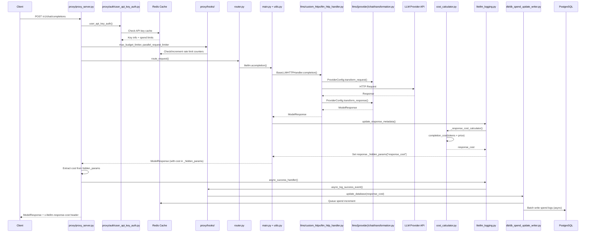
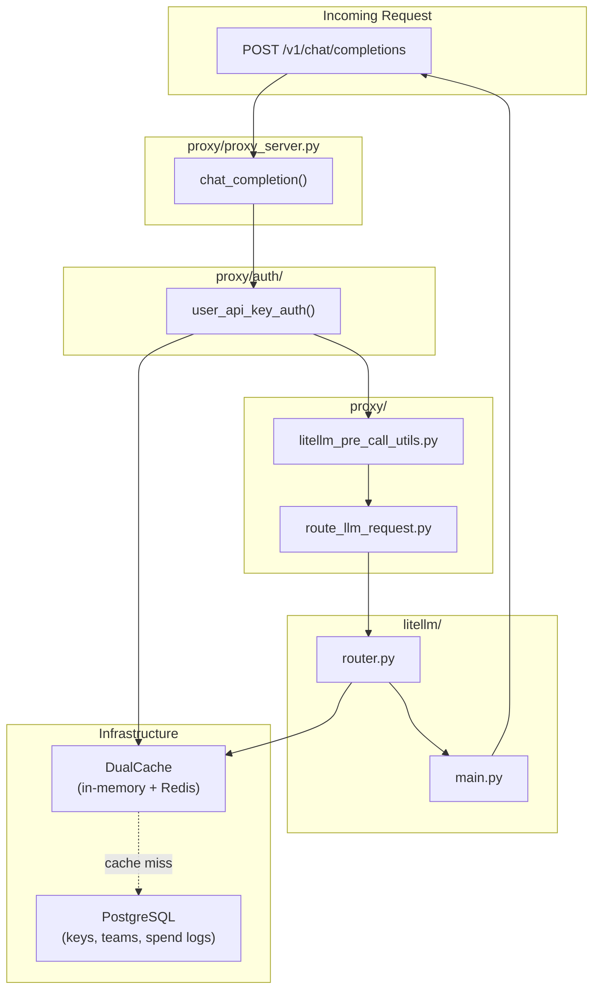
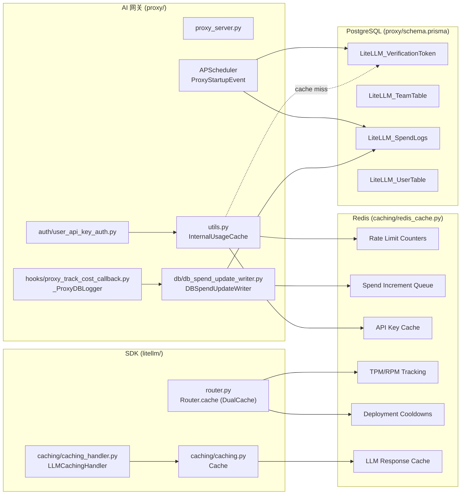
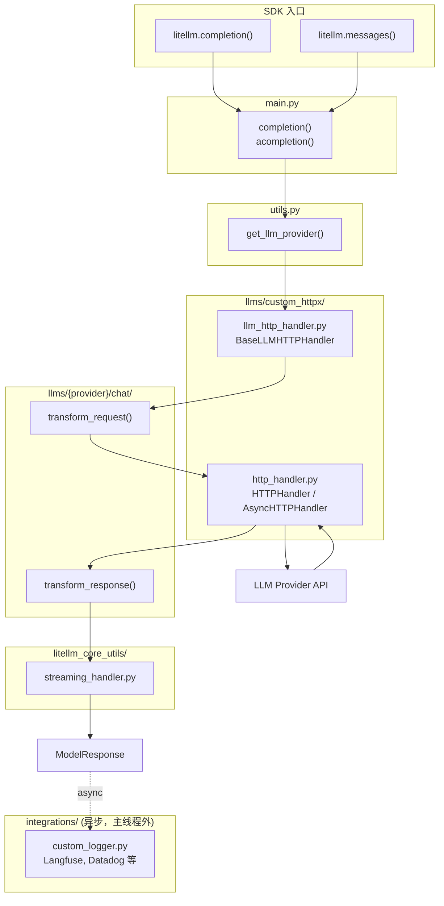

# LiteLLM 架构 — LiteLLM SDK + AI 网关

本文档帮助贡献者理解 LiteLLM 中各处代码的作用，以便精准修改。

---

## 工作原理

LiteLLM AI 网关（Proxy）在内部使用 LiteLLM SDK 来完成所有 LLM 调用：

```
OpenAI SDK (client)    ──▶  LiteLLM AI 网关 (proxy/)  ──▶  LiteLLM SDK (litellm/)  ──▶  LLM API
Anthropic SDK (client) ──▶  LiteLLM AI 网关 (proxy/)  ──▶  LiteLLM SDK (litellm/)  ──▶  LLM API
Any HTTP client        ──▶  LiteLLM AI 网关 (proxy/)  ──▶  LiteLLM SDK (litellm/)  ──▶  LLM API
```

**AI 网关**在 SDK 之上叠加了认证、限流、预算控制和路由能力。
**SDK**负责实际的 LLM provider 调用、请求/响应转换和流式输出。

---

## 1. AI 网关（Proxy）请求流程

AI 网关（`litellm/proxy/`）在 SDK 之上封装了认证、限流和管理功能。



### 网关组件



**核心网关文件：**
- `proxy/proxy_server.py` - 主 API 端点
- `proxy/auth/` - 认证（API Key、JWT、OAuth2）
- `proxy/hooks/` - 网关级回调
- `router.py` - 负载均衡、故障转移
- `router_strategy/` - 路由算法（`lowest_latency.py`、`simple_shuffle.py` 等）

**LLM 专属网关端点：**

| 端点 | 目录 | 用途 |
|----------|-----------|---------|
| `/v1/messages` | `proxy/anthropic_endpoints/` | Anthropic Messages API |
| `/vertex-ai/*` | `proxy/vertex_ai_endpoints/` | Vertex AI 直通 |
| `/gemini/*` | `proxy/google_endpoints/` | Google AI Studio 直通 |
| `/v1/images/*` | `proxy/image_endpoints/` | 图片生成 |
| `/v1/batches` | `proxy/batches_endpoints/` | 批量处理 |
| `/v1/files` | `proxy/openai_files_endpoints/` | 文件上传 |
| `/v1/fine_tuning` | `proxy/fine_tuning_endpoints/` | 微调任务 |
| `/v1/rerank` | `proxy/rerank_endpoints/` | 重排序 |
| `/v1/responses` | `proxy/response_api_endpoints/` | OpenAI Responses API |
| `/v1/vector_stores` | `proxy/vector_store_endpoints/` | 向量存储 |
| `/*`（直通） | `proxy/pass_through_endpoints/` | 直连 Provider |

**网关钩子**（`proxy/hooks/__init__.py`）：

| 钩子 | 文件 | 用途 |
|------|------|---------|
| `max_budget_limiter` | `proxy/hooks/max_budget_limiter.py` | 强制执行预算限制 |
| `parallel_request_limiter` | `proxy/hooks/parallel_request_limiter_v3.py` | 按 Key/User 限流 |
| `cache_control_check` | `proxy/hooks/cache_control_check.py` | 缓存校验 |
| `responses_id_security` | `proxy/hooks/responses_id_security.py` | 响应 ID 校验 |
| `litellm_skills` | `proxy/hooks/litellm_skills/main.py` | 技能注入 |

新增网关钩子：实现 `CustomLogger` 并注册到 `PROXY_HOOKS` 即可。

### 基础设施组件

AI 网关依赖外部基础设施来做持久化和缓存：



| 组件 | 用途 | 关键文件/类 |
|-----------|---------|-------------------|
| **Redis** | 限流、API Key 缓存、TPM/RPM 追踪、冷却期、LLM 响应缓存、消费队列 | `caching/redis_cache.py`（`RedisCache`）、`caching/dual_cache.py`（`DualCache`） |
| **PostgreSQL** | API Key、团队、用户、消费日志 | `proxy/utils.py`（`PrismaClient`）、`proxy/schema.prisma` |
| **InternalUsageCache** | 网关级限流 + API Key 缓存（内存 + Redis） | `proxy/utils.py`（`InternalUsageCache`） |
| **Router.cache** | TPM/RPM 追踪、部署冷却、客户端缓存（内存 + Redis） | `router.py`（`Router.cache: DualCache`） |
| **LLMCachingHandler** | SDK 级 LLM 响应/Embedding 缓存 | `caching/caching_handler.py`（`LLMCachingHandler`）、`caching/caching.py`（`Cache`） |
| **DBSpendUpdateWriter** | 批量写入消费更新，减少 DB 写入次数 | `proxy/db/db_spend_update_writer.py`（`DBSpendUpdateWriter`） |
| **Cost Tracking** | 计算并记录响应成本 | `proxy/hooks/proxy_track_cost_callback.py`（`_ProxyDBLogger`） |

**后台任务**（APScheduler，在 `proxy/proxy_server.py` → `ProxyStartupEvent.initialize_scheduled_background_jobs()` 中初始化）：

| 任务 | 间隔 | 用途 | 关键文件 |
|-----|----------|---------|-----------|
| `update_spend` | 60s | 批量写入消费日志到 PostgreSQL | `proxy/db/db_spend_update_writer.py` |
| `reset_budget` | 10-12min | 重置 Key/用户/团队预算 | `proxy/common_utils/reset_budget_job.py` |
| `add_deployment` | 10s | 从 DB 同步新的模型部署 | `proxy/proxy_server.py`（`ProxyConfig`） |
| `cleanup_old_spend_logs` | cron/interval | 删除旧消费日志 | `proxy/db/db_transaction_queue/spend_log_cleanup.py` |
| `check_batch_cost` | 30min | 计算批量任务成本 | `enterprise/litellm_enterprise/proxy/common_utils/check_batch_cost.py` |
| `check_responses_cost` | 30min | 计算 Responses API 成本 | `enterprise/litellm_enterprise/proxy/common_utils/check_responses_cost.py` |
| `process_rotations` | 1hr | 自动轮换 API Key | `proxy/common_utils/key_rotation_manager.py` |
| `_run_background_health_check` | 持续 | 对模型部署做健康检查 | `proxy/proxy_server.py` |
| `send_weekly_spend_report` | weekly | Slack 消费告警 | `proxy/utils.py`（`SlackAlerting`） |
| `send_monthly_spend_report` | monthly | Slack 消费告警 | `proxy/utils.py`（`SlackAlerting`） |

**成本归属流程：**
1. LLM 响应在 `litellm.acompletion()` 完成后返回到 `utils.py` 包装器
2. 调用 `update_response_metadata()`（`litellm_core_utils/llm_response_utils/response_metadata.py`）
3. `logging_obj._response_cost_calculator()`（`litellm_core_utils/litellm_logging.py`）通过 `litellm.completion_cost()`（`cost_calculator.py`）计算成本
4. 成本存储在 `response._hidden_params["response_cost"]`
5. `proxy/common_request_processing.py` 从 `hidden_params` 提取成本并加入响应头（`x-litellm-response-cost`）
6. `logging_obj.async_success_handler()` 触发回调，包括 `_ProxyDBLogger.async_log_success_event()`
7. `DBSpendUpdateWriter.update_database()` 将消费增量放入 Redis 队列
8. 后台任务 `update_spend` 每 60s 将队列中的消费批量写入 PostgreSQL

### 数据访问层（Models & Repositories）

数据库实体及其操作统一放在 `litellm/` 根目录下的两个包中，这样网关（`proxy/`）和 SDK 都能使用它们，而无需导入 proxy 内部模块：

- `litellm/models/` 存放所有持久化实体的标准 Pydantic 定义（`LiteLLM_VerificationToken`、`LiteLLM_TeamTable`、`LiteLLM_UserTable` 等）。`proxy/_types.py` 重新导出这些模型以保持向后兼容，现有导入不受影响。
- `litellm/repositories/` 存放数据访问层。`BaseRepository[T]` 提供通用 CRUD 操作（`find_by_id`、`find_many`、`create`、`update`、`delete`、`count`、`exists`）；实体仓库如 `VerificationTokenRepository`、`TeamRepository`、`UserRepository` 在此基础上添加了领域特定的查询和写入方法。

操作此层时需遵循以下规范：

| 关注点 | 处理方式 |
|---------|------------------|
| JSON 列 | Prisma `Json` 列以 JSON 字符串存储。仓库在写入时 `json.dumps()`，读取时 `json.loads()`（参见 `_to_model` 和 `_build_*_data` 辅助方法）。 |
| 归档后删除 | `delete_team` / `delete_token` 将行复制到 `LiteLLM_Deleted*` 表，然后在单个 `prisma_client.db.tx()` 事务中删除原记录。归档载荷显式构建，只写入归档表上存在的列。 |
| 列名 vs 字段名 | 模型字段与数据库列名不一致时（如 `org_id` 映射到 `organization_id` 列），仓库在两个方向上都做转换，而不是依赖 Pydantic 猜测。 |
| 数组变更 | 添加操作使用 Prisma 原子 `push`（`add_member`、`add_admin`、`add_models`）避免读-改-写竞态。删除操作降级为读-改-写，因为 Prisma 没有原子数组删除操作。 |

新增实体：定义模型放 `litellm/models/`，如果已有代码从 `proxy/_types.py` 导入则重新导出到该文件，添加仓库放 `litellm/repositories/`（通用 CRUD 继承 `BaseRepository`；需要加密、归档或原子数组更新则添加自定义方法）。在 `tests/test_litellm/repositories/` 中补充测试。

---

## 2. SDK 请求流程

SDK（`litellm/`）提供核心 LLM 调用能力，供直接使用 SDK 的用户和 AI 网关两者共同使用。



**核心 SDK 文件：**
- `main.py` - 入口：`completion()`、`acompletion()`、`embedding()`
- `utils.py` - `get_llm_provider()` 将 model 解析为 provider
- `llms/custom_httpx/llm_http_handler.py` - 中心 HTTP 编排器
- `llms/custom_httpx/http_handler.py` - 底层 HTTP 客户端
- `llms/{provider}/chat/transformation.py` - Provider 专属转换
- `litellm_core_utils/streaming_handler.py` - 流式响应处理
- `integrations/` - 异步回调（Langfuse、Datadog 等）

---

## 3. 转换层

请求进来后会经过一个**转换层**，在不同 API 格式之间做转换。每个转换逻辑独立放在各自文件中，方便单独测试和修改。

### 转换文件位置

| 传入 API | Provider | 转换文件 |
|--------------|----------|------------------|
| `/v1/chat/completions` | Anthropic | `llms/anthropic/chat/transformation.py` |
| `/v1/chat/completions` | Bedrock Converse | `llms/bedrock/chat/converse_transformation.py` |
| `/v1/chat/completions` | Bedrock Invoke | `llms/bedrock/chat/invoke_transformations/anthropic_claude3_transformation.py` |
| `/v1/chat/completions` | Gemini | `llms/gemini/chat/transformation.py` |
| `/v1/chat/completions` | Vertex AI | `llms/vertex_ai/gemini/transformation.py` |
| `/v1/chat/completions` | OpenAI | `llms/openai/chat/gpt_transformation.py` |
| `/v1/messages`（直通） | Anthropic | `llms/anthropic/experimental_pass_through/messages/transformation.py` |
| `/v1/messages`（直通） | Bedrock | `llms/bedrock/messages/invoke_transformations/anthropic_claude3_transformation.py` |
| `/v1/messages`（直通） | Vertex AI | `llms/vertex_ai/vertex_ai_partner_models/anthropic/experimental_pass_through/transformation.py` |
| 直通端点 | 全部 | `proxy/pass_through_endpoints/llm_provider_handlers/` |

### 示例：调试提示词缓存

如果 `/v1/messages` → Bedrock Converse 提示词缓存不生效，但 Bedrock Invoke 正常：

1. **Bedrock Converse 转换**：`llms/bedrock/chat/converse_transformation.py`
2. **Bedrock Invoke 转换**：`llms/bedrock/chat/invoke_transformations/anthropic_claude3_transformation.py`
3. 对比两者在 `transform_request()` 中对 `cache_control` 的处理方式

### 转换原理

每个 Provider 都有一个继承自 `BaseConfig`（`llms/base_llm/chat/transformation.py`）的 `Config` 类：

```python
class ProviderConfig(BaseConfig):
    def transform_request(self, model, messages, optional_params, litellm_params, headers):
        # 将 OpenAI 格式 → Provider 格式
        return {"messages": transformed_messages, ...}
    
    def transform_response(self, model, raw_response, model_response, logging_obj, ...):
        # 将 Provider 格式 → OpenAI 格式
        return ModelResponse(choices=[...], usage=Usage(...))
```

`BaseLLMHTTPHandler`（`llms/custom_httpx/llm_http_handler.py`）调用这些方法——无需修改 Handler 本身。

---

## 4. 添加/修改 Provider

### 添加新 Provider：

1. 创建 `llms/{provider}/chat/transformation.py`
2. 实现 `Config` 类，包含 `transform_request()` 和 `transform_response()`
3. 在 `tests/llm_translation/test_{provider}.py` 添加测试

### 添加新功能（如提示词缓存）：

1. 从上表找到对应的转换文件
2. 修改 `transform_request()` 以处理新参数
3. 添加单元测试验证转换结果

### 测试清单

添加功能后，需验证以下路径均正常工作：

| 测试 | 文件匹配模式 |
|------|--------------|
| OpenAI 直通 | `tests/llm_translation/test_openai*.py` |
| Anthropic 直连 | `tests/llm_translation/test_anthropic*.py` |
| Bedrock Invoke | `tests/llm_translation/test_bedrock*.py` |
| Bedrock Converse | `tests/llm_translation/test_bedrock*converse*.py` |
| Vertex AI | `tests/llm_translation/test_vertex*.py` |
| Gemini | `tests/llm_translation/test_gemini*.py` |

### 单元测试转换逻辑

转换逻辑设计为无需发起真实 API 调用即可单元测试：

```python
from litellm.llms.bedrock.chat.converse_transformation import BedrockConverseConfig

def test_prompt_caching_transform():
    config = BedrockConverseConfig()
    result = config.transform_request(
        model="anthropic.claude-3-opus",
        messages=[{"role": "user", "content": "test", "cache_control": {"type": "ephemeral"}}],
        optional_params={},
        litellm_params={},
        headers={}
    )
    assert "cachePoint" in str(result)  # 验证 cache_control 被正确转换
```
