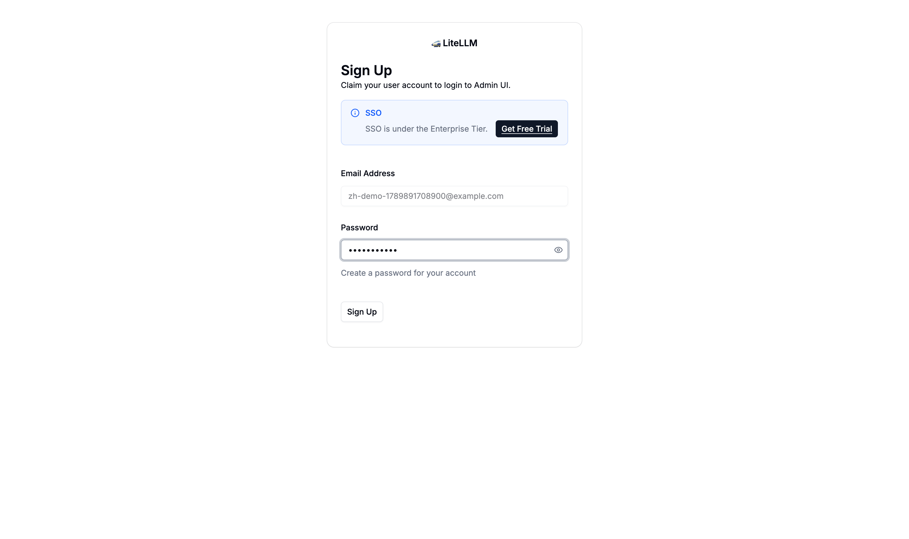
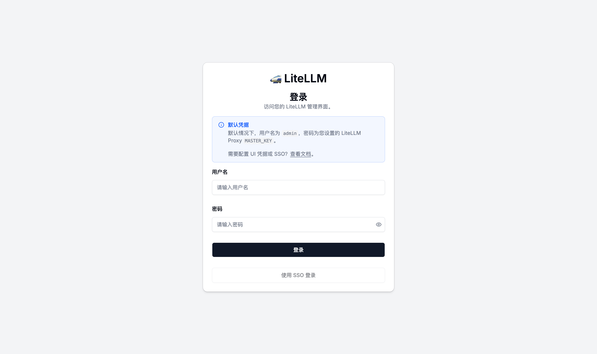
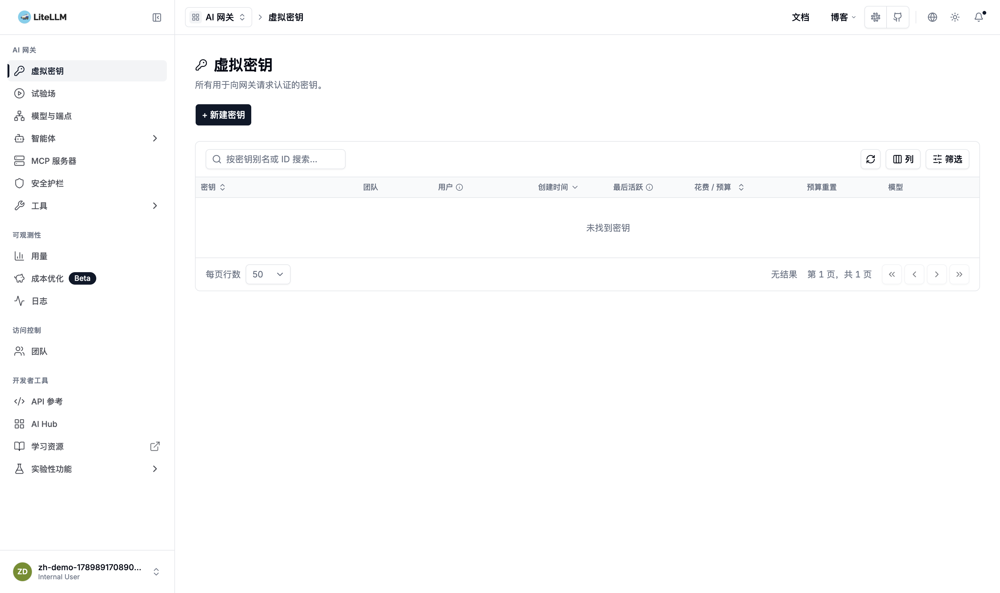
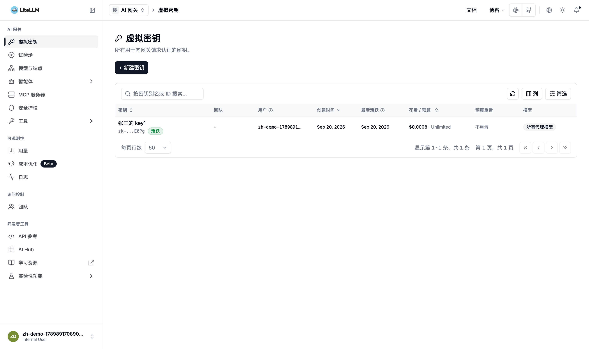
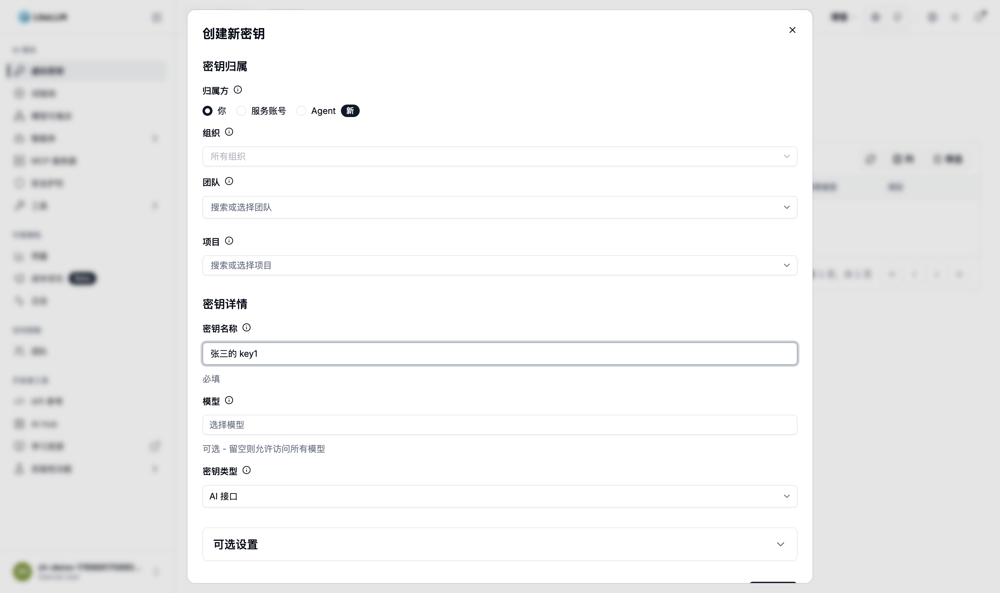
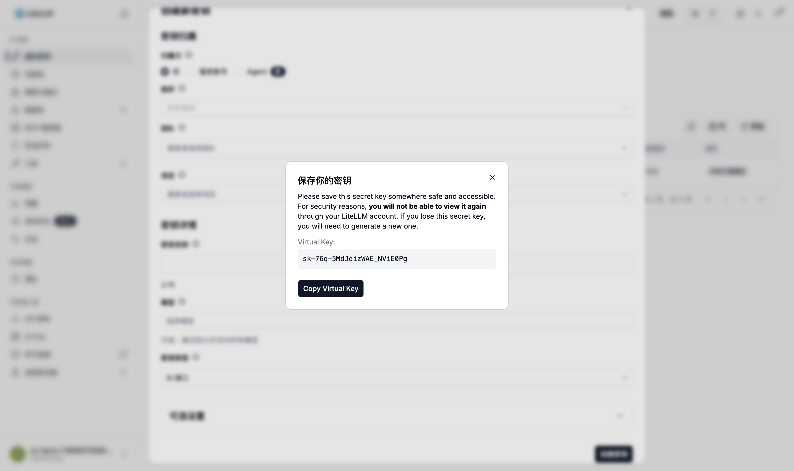
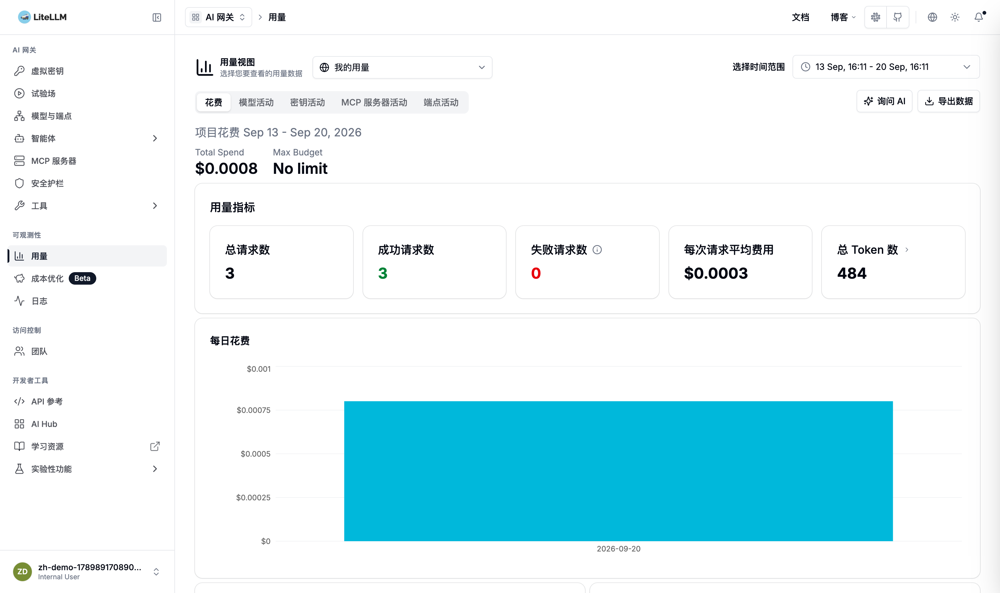

# AI Token 网关使用手册

本文档面向已收到管理员邀请链接的同事，说明如何完成账号注册、创建 API Key，以及在业务系统中调用大模型接口

网关地址：http://192.168.7.99:4000

管理后台：http://192.168.7.99:4000/ui/

> **Warning**
>
> 内网地址说明：当前地址为公司内网地址，仅限公司网络环境下访问。Cursor、Continue、Dify 等外部 SaaS 工具无法直接访问内网地址，若需在这些工具中使用，请联系管理员获取外网网关地址或配置网络代理

---

## 一、变更记录

| 版本 | 日期 | 变更摘要 | 修改人 |
|---|---|---|---|
| v1.9 | 2026-09-20 | 网关升级为中文版镜像 `litellm-zhcn:v1.100.0-zh.4`，按中文界面重做全部截图与菜单名；补充界面中英混排说明 | 张忠源 |
| v1.8 | 2026-09-15 | 按网关 v1.100.0 重做截图；`deepseek-chat` 已停止服务，模型表改为 `deepseek-v4-flash` / `deepseek-v4-pro`；`reasoning_content` 工具调用兼容问题已解决 | 张忠源 |
| v1.7 | 2026-08-11 | 网关地址切换为 192.168.7.99；新增中文管理后台（端口 80） | 张忠源 |
| v1.6 | 2026-06-05 | 网关地址切换为内网地址 192.168.8.151:4000；补充内网环境下 Cursor 等外部工具不可用的说明 | 张忠源 |
| v1.3 | 2026-05-25 | 新增 deepseek-chat；新增 V4 reasoning_content 兼容说明 | 张忠源 |
| v1.2 | - | 补充 deepseek-v4-flash / deepseek-v4-pro 调用示例与配图 | 张忠源 |
| v1.1 | - | 完善注册邀请、Virtual Key 流程 | 张忠源 |
| v1.0 | - | 首版：网关地址、Base URL、基本调用说明 | 张忠源 |

### v1.9 相比 v1.8 的主要变化

管理后台已升级为中文版界面。菜单、列表表头、按钮大部分已中文化，但部分弹窗和按钮仍是英文

**看到英文不是故障，也不代表你操作错了。** 按本文标注的名称找对应入口即可，实测各处的语言情况见下表：

| 位置 | 语言 |
|---|---|
| 登录页、左侧菜单、密钥列表、用量页面 | 中文 |
| 创建密钥弹窗 | 中文 |
| 保存密钥弹窗 | 标题中文，正文与 Copy 按钮英文 |
| 注册（Sign Up）页面 | 英文 |
| 界面里的角色名称（如 Internal User） | 英文 |
| 用量页的表格/图表切换按钮 | 英文 |
| 右上角账号区 | 英文 |

---

## 二、你能用这个网关做什么？

通过公司统一的 AI Token 网关调用已开通的 DeepSeek 模型，无需每人单独申请厂商账号

当前可稳定使用的模型：

| 模型名 | 说明 |
|---|---|
| `deepseek-v4-flash` | 快速版，推荐日常使用。适合日常对话、代码补全等对响应速度要求较高的场景 |
| `deepseek-v4-pro` | 增强版，适合复杂推理、长文档分析等对效果要求较高的场景 |
| `deepseek-v4-flash-vision-exp` | 实验性视觉版本，支持图片输入，按需试用 |
| `deepseek/deepseek-chat` | 上一代通用对话模型，兼容性好。不带前缀的 `deepseek-chat` 已不可用 |

在管理后台为自己创建虚拟密钥（Virtual Key），在代码、Cursor、Dify 等工具里调用

用量与额度由管理员在后台统一管控

---

## 三、接受邀请并完成注册

### 3.1 打开邀请链接

管理员会通过企微/邮件等方式发送邀请链接，形如：

```
http://192.168.7.99:4000/ui/onboarding?invitation_id=xxxxxxxx-xxxx-xxxx-xxxx-xxxxxxxxxxxx
```

1. 在浏览器（推荐 Chrome / Edge）中完整打开该链接
2. 勿随意删减 URL 中的 invitation_id 参数

注册页面目前仍是英文，标题为 Sign Up，说明为 Claim your user account to login to Admin UI


页面上的 SSO 入口属于企业版功能，当前未启用，忽略即可

### 3.2 设置登录密码



1. Email Address（邮箱）：已预填为你的公司邮箱，不可修改
2. Password（密码）：自行设置登录管理后台的密码（请妥善保管）
3. 点击 Sign Up 完成注册

注册完成后浏览器会自动跳转到 http://192.168.7.99:4000/ui/?login=success ，此时你已经处于登录状态

### 3.3 注册成功后的登录

以后使用以下地址进入管理后台：

```
http://192.168.7.99:4000/ui
```



使用邀请中的邮箱 + 刚设置的密码登录，登录按钮显示为 `登录`

登录后默认进入虚拟密钥页面，右上角显示你的邮箱，左侧菜单只包含你权限范围内的功能



> **Warning**
>
> 登录页提示里写的 `admin` / `MASTER_KEY` 是给管理员用的，普通用户不要尝试，直接用你自己的邮箱和密码登录

### 3.4 常见问题

| 现象 | 处理建议 |
|---|---|
| 提示邀请无效或已过期 | 联系管理员发送重置密码链接（邀请链接有效期 7 天） |
| 链接打开后仍是别人已登录的账号 | 先退出登录，或用浏览器无痕模式重新打开邀请链接 |
| 忘记密码 | 联系管理员发送重置密码链接 |
| 登录后看不到虚拟密钥菜单，或看不到 `+ 新建密钥` 按钮 | 联系管理员确认账号角色。只有 `Internal User (Create/Delete/View)` 角色才能创建密钥，`Internal User (View Only)` 只能查看 |

---

## 四、创建虚拟密钥（API 密钥）

### 4.1 新建密钥

登录后，在左侧菜单进入 **虚拟密钥**：



页面展示你名下的所有密钥，包含密钥别名、创建时间、最后活跃时间、花费与预算、可用模型

1. 点击 `+ 新建密钥` 按钮
2. 按表单填写

   

   | 字段 | 填写说明 |
   |---|---|
   | 密钥归属 - 归属方 | 选择 `你` |
   | 密钥归属 - 团队 | 不要选择 |
   | 密钥名称 | 按命名规范填写：【姓名】的 key【编号】，例如「张三的 key1」「张三的 key2」 |
   | 模型 | 留空表示可访问管理员为你开通的全部模型 |
   | 密钥类型 | 保持默认 `AI 接口` |
   | 可选设置 | 一般不用填，需要设预算或限流时再展开 |

3. 点击 `创建密钥` 确认创建

### 4.2 复制并保存密钥（重要）

创建成功后，系统会一次性展示完整密钥，一般以 `sk-` 开头



窗口标题 `保存你的密钥`，正文与 `Copy Virtual Key` 按钮仍是英文

1. 立即点击 `Copy Virtual Key` 复制到安全位置（如公司批准的密码管理器）
2. 关闭弹窗后无法再次查看完整密钥；若遗失，只能删除旧 Key 后重新创建
3. 勿将密钥发到群聊、截图外发或提交到公开代码仓库

> **Warning**
>
> 密钥等同于你的身份凭证，任何拿到它的人都能以你的额度调用模型并产生费用

---

## 五、使用 Key 调用模型

### 5.1 调用方式说明

网关提供与 OpenAI 兼容的 HTTP 接口，在请求头中携带密钥即可：

```
Base URL：            http://192.168.7.99:4000/v1
Authorization: Bearer <你的 Virtual Key>
```

调用时在请求体中填写 model 字段，当前网关已开通以下模型名（须完全一致）：

| 模型名 | 说明 |
|---|---|
| `deepseek-v4-flash` | 快速版，推荐日常使用。适合日常对话、代码补全等场景 |
| `deepseek-v4-pro` | 增强版，适合复杂推理、长文档分析等场景 |
| `deepseek-v4-flash-vision-exp` | 实验性视觉版本，支持图片输入 |
| `deepseek/deepseek-chat` | 上一代通用对话模型，兼容性好，适合带工具调用的 Agent 场景 |

注意 `deepseek-chat`（不带前缀）已停止服务，调用会返回 400 `There are no healthy deployments for this model`。v1.7 手册中的 `deepseek-chat` 相关内容请全部替换为上表的名字

可以在虚拟密钥页面查看密钥行末尾的 `模型` 列，确认这把密钥被允许访问的模型范围

> **Warning**
>
> 不要用 `GET /v1/models` 作为可用模型的依据。该接口目前会返回 20 个名字，其中 `deepseek-chat`、`deepseek-reasoner`、`deepseek/deepseek-r1`、`deepseek/deepseek-v3.2` 等并没有实际可用的上游，调用一律返回 400。请以上表的四个名字为准

管理后台的 `模型与端点` 页面是给管理员用的模型管理页，普通用户在那里看不到可用的模型清单，不要用它来核对模型名

### 5.2 命令行快速验证

将下面命令中的 `<你的Key>` 替换为真实密钥：

```bash
curl -sS "http://192.168.7.99:4000/v1/chat/completions" \
  -H "Content-Type: application/json" \
  -H "Authorization: Bearer <你的Key>" \
  -d '{
    "model": "deepseek-v4-flash",
    "messages": [
      {"role": "user", "content": "你好，请用一句话介绍你自己"}
    ]
  }'
```

若返回 JSON 且包含 `choices`，说明 Key 与模型配置正常。实测返回示例（已截断）：

```json
{
  "model": "deepseek-v4-flash",
  "object": "chat.completion",
  "choices": [
    {
      "finish_reason": "stop",
      "index": 0,
      "message": {
        "role": "assistant",
        "content": "你好！我是由深度求索公司开发的AI助手DeepSeek，可以帮你解答问题、处理信息并提供创意支持。"
      }
    }
  ],
  "usage": {
    "prompt_tokens": 31,
    "completion_tokens": 20,
    "total_tokens": 51,
    "prompt_cache_hit_tokens": 0,
    "prompt_cache_miss_tokens": 31
  }
}
```

### 5.3 在常用工具中配置（示例）

| 工具 | 配置项 | 填写说明 |
|---|---|---|
| Cursor / Continue 等 | API Base URL | `http://192.168.7.99:4000/v1` |
| | API Key | 你的 Virtual Key（`sk-...`） |
| | Model | `deepseek-v4-flash` 或 `deepseek-v4-pro` |
| Python（OpenAI SDK） | base_url | `http://192.168.7.99:4000/v1` |
| | api_key | 你的 Virtual Key |

Python 示例：

```python
from openai import OpenAI

client = OpenAI(
    base_url="http://192.168.7.99:4000/v1",
    api_key="<你的Key>",
)

response = client.chat.completions.create(
    model="deepseek-v4-flash",  # 或 "deepseek-v4-pro"
    messages=[{"role": "user", "content": "你好"}],
)

print(response.choices[0].message.content)
```

> **Warning**
>
> Cursor、Continue、Dify 等外部工具/SaaS 平台无法访问公司内网地址（192.168.7.99）。若需在这些工具中使用网关，请联系管理员获取外网网关地址，或在本地网络环境中配置代理后使用

### 5.4 常见问题

| 现象 | 原因说明 | 处理建议 |
|---|---|---|
| 报错 400，提示 `There are no healthy deployments for this model` | 模型名不存在或已下线。典型情况是仍在用 `deepseek-chat` | 改用 `deepseek-v4-flash` 或 `deepseek-v4-pro`；需要上一代对话模型时用 `deepseek/deepseek-chat` |
| 报错 403，提示 `User not allowed to access model` | 模型未对该用户开通 | 联系网关管理员在用户配置里补配模型范围 |
| 报错 401，提示 `Invalid proxy server token passed` | 密钥错误、已被删除或已过期 | 核对密钥是否完整复制；必要时在虚拟密钥页面重建 |
| Cursor 等工具连不上 | 内网地址在外部 SaaS 工具中不可达 | 见 5.3 的 Warning，联系管理员获取外网地址或配置代理 |
| 单轮 curl 成功，但工具里多轮对话失败 | 需具体排查，网关侧已确认支持多轮工具调用 | 先用 5.2 的 curl 确认网关侧正常，再把工具的完整请求日志发给管理员排查 |

v1.7 手册里关于 `reasoning_content` 必须回传导致 400 的条目已在 v1.8 移除。在网关上实测，`deepseek-v4-flash` 与 `deepseek-v4-pro` 的多轮工具调用，带与不带 `reasoning_content` 都能正常返回，不再需要为兼容该字段而回避 V4 系列

### 5.5 使用注意

- 仅调用已授权的模型；若返回 `model not found` 或 403，请联系管理员开通
- 密钥泄露请立即联系管理员作废并重建
- 开发环境请勿将 Key 写入前端页面或上传到 Git
- 长上下文请求的输入 token 计费较高，缓存命中的输入按更低单价计费，重复的系统提示词有助于降低成本

---

## 六、查看自己的用量（可选）

登录管理后台后，在左侧菜单进入 **用量**，页面默认就是你的个人用量视图



花费标签页展示所选时间范围内的个人消费总额（Project Spend）、请求数、成功与失败请求数、每次请求平均费用、总 Token 数，以及每日花费柱状图。页面继续往下是虚拟密钥排行（名下各密钥的消费排名）、公开模型名称排行（各模型消费排名）与按提供商的消费汇总

需要按调用类型细分时，切换到 `密钥活动`、`端点活动` 等标签页查看

在 **虚拟密钥** 页面也能直接看到每个密钥行的消费金额（花费 / 预算 列），以及最后活跃时间

---

## 七、需要帮助时找谁？

| 问题类型 | 联系人 |
|---|---|
| 收不到邀请、链接失效、忘记密码 | 网关管理员 |
| 没有可用模型、调用报错 | 网关管理员 |
| Key 泄露、额度异常 | 网关管理员 |

---

## 附录：操作流程一览

```
收到邀请链接
  -> 打开链接注册（Sign Up，地址形如 /ui/onboarding?invitation_id=...）
  -> 登录 http://192.168.7.99:4000/ui
  -> 左侧菜单 虚拟密钥 -> + 新建密钥（归属方选「你」，密钥名称按「姓名 + 的 key + 编号」）
  -> 弹出保存你的密钥窗口，立即 Copy Virtual Key 并妥善保存
  -> 在应用里配置 Base URL（http://192.168.7.99:4000/v1）+ API Key + Model
  -> 调用 /v1/chat/completions
```
