# AI Token 网关管理员操作手册

本文档面向网关管理员，说明如何通过 LiteLLM 管理后台创建新用户、生成邀请链接、以及查看请求日志与用量统计

本文档基于 v1.0 重写，界面截图全部取自当前生产环境 `192.168.7.99` 上运行的 LiteLLM `v1.100.0` 内置管理后台

管理后台：http://192.168.7.99:4000/ui/

网关地址：http://192.168.7.99:4000

---

## 一、变更记录

| 版本 | 日期 | 变更摘要 | 修改人 |
|---|---|---|---|
| v1.0 | 2026-08-11 | 初始版本 | 张忠源 |
| v1.1 | 2026-09-15 | 按 v1.100.0 内置管理后台重做全部截图，修正邀请链接地址、用户列表字段、日志字段、日志导出、个人用量入口等过时描述 | 张忠源 |

### 本次主要变化

网关在 2026-09-10 从 `v1.83.14-stable.patch.3` 升级到 `v1.100.0`，管理后台随之后端同版本，界面与 v1.0 手册相比有以下差异，本文正文均已按新界面改写：

| 项目 | v1.0 手册描述 | v1.1 实际界面 |
|---|---|---|
| 邀请链接地址 | `http://192.168.7.99:4000/ui?invitation_id=...` | `http://192.168.7.99:4000/ui/onboarding?invitation_id=...` |
| 邀请表单字段 | User Email、Global Proxy Role、Team、Organization、Send invitation email | 新增 Metadata、Personal Key Creation；Global Proxy Role 默认值变为 `Internal User (View Only)` |
| 创建用户入口 | 仅有 Invite User | 另有 `+ Bulk Invite Users` 批量邀请 |
| 用户列表字段 | User ID、Email、Role、Spend、Budget、Status | User ID、Email、Status、Global Proxy Role、User Alias、Spend (USD)、Budget (USD)、SSO ID、Virtual Keys、Created At、Updated At、Actions |
| 日志页面 | 单一请求日志列表 | 分为 Request Logs、Audit Logs、Deleted Keys、Deleted Teams 四个标签页 |
| 日志列表字段 | Request ID、Model、User、Spend、Total Tokens、Prompt Tokens、Completion Tokens、Duration、Status、Time、Cache Hit | Time、Type、Status、Session ID、Request ID、Cost、Duration (s)、TTFT (s)、Team Name、Key Hash、Key Alias、Model、Tokens、Internal User、End User、Tags |
| 日志筛选 | 页面顶部常驻筛选条 | 收敛到 `Filters` 按钮后的筛选面板，字段扩充到 Team ID、Key Alias、Model、User ID、End User、Error Code、Status、Cache、Error Message、Key Hash、Session ID 等 |
| 日志详情 | 点击日志展开详情面板 | 点击行从右侧滑出详情抽屉，含 TRACE 调用链、Metrics、Cost Breakdown、Tools 与 Request/Response 原文 |
| 日志导出 | 日志页面支持筛选后导出 | 日志页面不再提供导出。导出功能移到 Usage 页面，见 4.5 |
| 邀请链接失效后的处理 | 在用户列表里重新生成邀请链接 | 界面不再提供重新生成邀请链接的入口，改用 `Reset password` 生成重置链接，见 3.5 |
| 个人用量入口 | Internal Users 页面点击用户详情查看个人消费趋势 | 用户详情页只展示账号信息。个人用量改为 Usage 页面按用户筛选，见 5.3 |
| 用量页面 | 按日期、用户、密钥、团队、模型、标签六个维度 | 重写为 Usage View，含 Global Usage / 时间范围 / Filter by user / 五个标签页 / Export Data / Ask AI |
| 创建密钥 | Key Name、Models | 增加 Key Ownership（Owned By、Organization、Team、Project）、Key Type、Optional Settings |

---

## 二、登录管理后台

在浏览器中打开 http://192.168.7.99:4000/ui/ ，进入 LiteLLM 管理后台登录页面

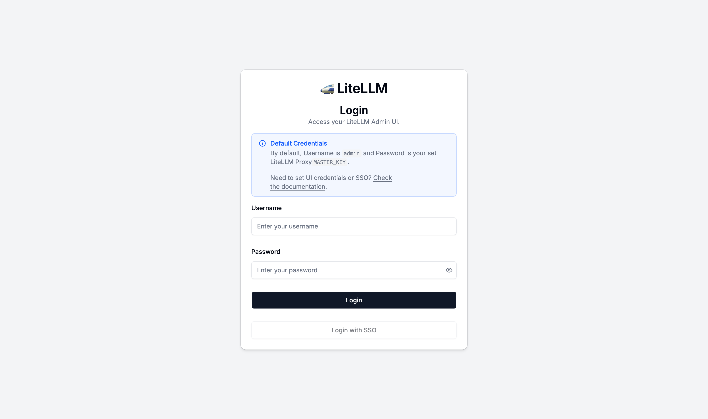

输入管理员用户名和密码，点击 Login 登录

管理员账号由网关部署时配置，通过服务器 `/opt/litellm/.env` 里的 `UI_USERNAME` / `UI_PASSWORD` 环境变量设定。页面上的提示文字说明，如果不单独设置这两个变量，默认用户名是 `admin`，密码是 `LITELLM_MASTER_KEY` 的值。生产环境已单独设置用户名和密码，请使用分配到的账号登录

登录后默认落在 **Virtual Keys** 页面（地址仍是 http://192.168.7.99:4000/ui/ ），也就是密钥列表

左侧菜单按 AI GATEWAY、OBSERVABILITY、ACCESS CONTROL、DEVELOPER TOOLS、SETTINGS 分组，左下角显示当前版本号 `v1.100.0`。管理员日常常用的三个入口是：

- ACCESS CONTROL 分组下的 **Internal Users**：用户管理
- OBSERVABILITY 分组下的 **Logs**：请求日志
- OBSERVABILITY 分组下的 **Usage**：用量统计

---

## 三、创建新用户并发送邀请

### 3.1 进入 Internal Users 页面

左侧菜单点击 **Internal Users**，进入用户管理列表页面。页面地址为 http://192.168.7.99:4000/ui/users

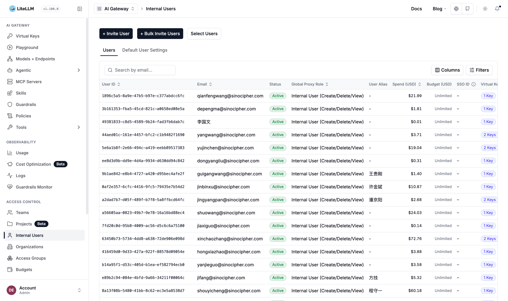

用户列表展示已注册用户的 User ID、Email、Status、Global Proxy Role、User Alias、Spend (USD)、Budget (USD)、SSO ID、Virtual Keys、Created At、Updated At、Actions

页面顶部有三个操作入口：列表左上方是按邮箱搜索的搜索框，`Columns` 按钮控制显示哪些列，`Filters` 按钮打开筛选面板。筛选面板提供 User ID、SSO ID、Role、Team 四个条件，填好后点 `Apply Filters` 生效

右上角有两个创建入口，单个创建用 `+ Invite User`，批量创建用 `+ Bulk Invite Users`

### 3.2 点击「+ Invite User」创建新用户

点击页面右上角的 `+ Invite User` 按钮，弹出创建用户表单

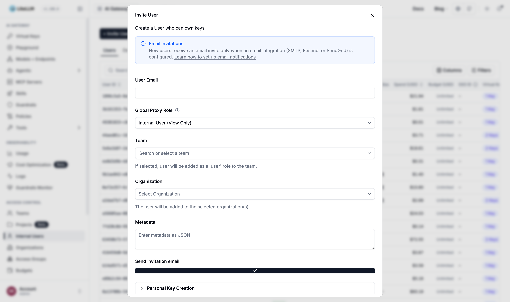

表单字段说明：

| 字段 | 说明 | 是否必填 |
|---|---|---|
| User Email | 用户的邮箱地址 | 是 |
| Global Proxy Role | 用户全局角色，默认 `Internal User (View Only)` | 否 |
| Team | 用户所属团队，选中后该用户会以 `user` 角色加入团队 | 否 |
| Organization | 用户所属组织，可多选 | 否 |
| Metadata | 附加元数据，JSON 格式 | 否 |
| Send invitation email | 是否发送邮件通知，需要先配置邮件服务 | 否 |
| Personal Key Creation | 是否允许该用户自行创建 API Key | 否 |

表单顶部有一段提示：只有在配置了邮件集成（SMTP、Resend 或 SendGrid）后，新用户才会收到邮件邀请。当前生产环境未配置邮件服务，因此不要依赖 `Send invitation email`，请按 3.4 手动复制邀请链接发给用户

### 3.3 填写用户信息

填写 `User Email`，按需选择 `Global Proxy Role` 与 `Team`，然后点击 `Invite User` 按钮完成创建

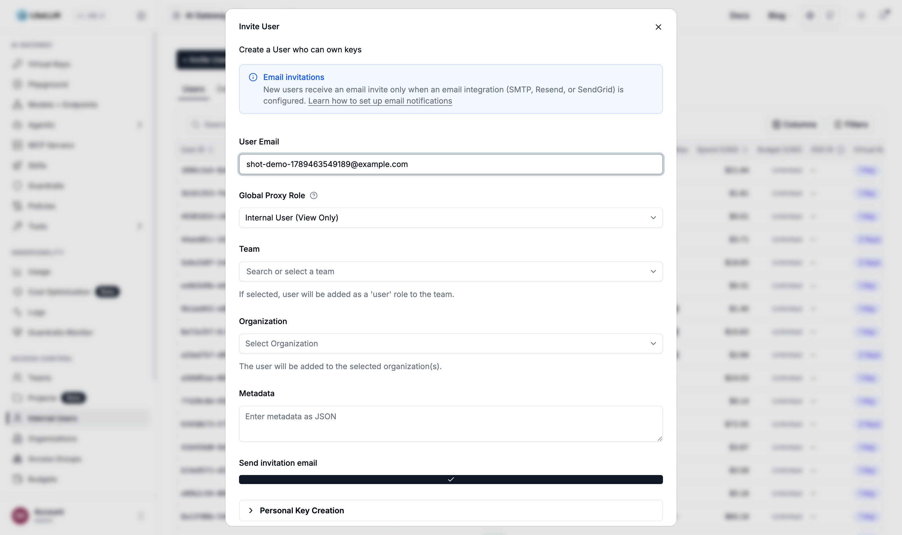

角色说明：`Internal User (View Only)` 只能查看，`Internal User (Create/Delete/View)` 可以自行创建和删除资源。如果需要用户能自己创建 API Key，除了选对角色，还要确认 `Personal Key Creation` 已开启

### 3.4 复制邀请链接

用户创建成功后，系统弹出 `Invitation Link` 弹窗，显示：

- **User ID**：用户的唯一标识
- **Invitation Link**：邀请链接

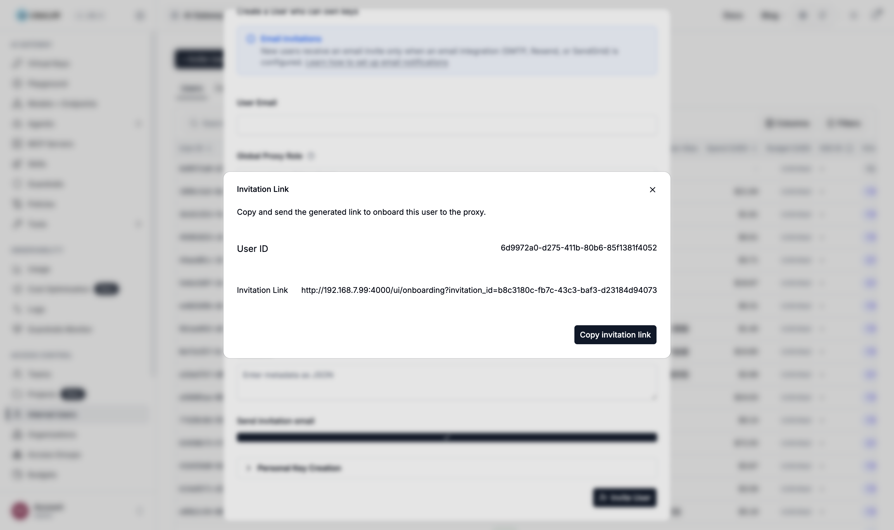

点击 `Copy invitation link` 按钮，将链接发送给用户

链接格式：

```
http://192.168.7.99:4000/ui/onboarding?invitation_id=xxxxxxxx-xxxx-xxxx-xxxx-xxxxxxxxxxxx
```

注意与 v1.0 手册的差异：路径是 `/ui/onboarding`，不再是 `/ui`

### 3.5 用户注册流程

用户点击邀请链接后，将打开 LiteLLM 注册页面（Sign Up）：

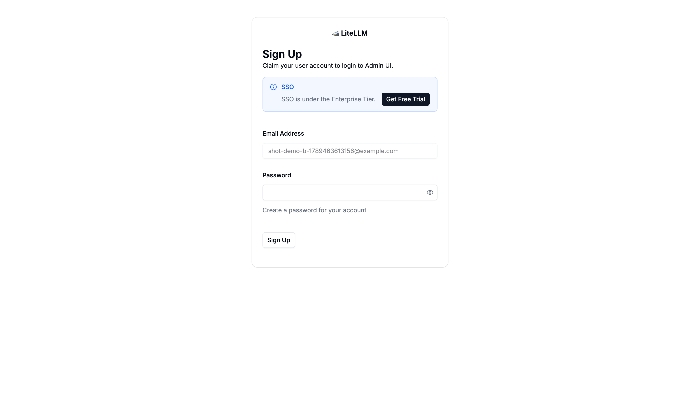

页面上：

- **Email Address**（邮箱）：已预填，不可修改
- **Password**（密码）：用户自行设置登录密码
- 点击 `Sign Up` 完成注册

页面上的 SSO 入口属于企业版功能，当前部署未启用，忽略即可

注册完成后，浏览器跳转到 `http://192.168.7.99:4000/ui/?login=success`，用户已处于登录状态，角色为 `Internal Viewer`

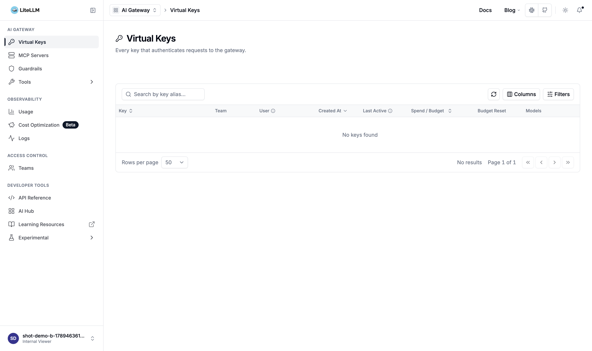

此后用户可随时使用邮箱加密码登录 http://192.168.7.99:4000/ui/

邀请链接有效期 7 天（数据库里 `expires_at` 减去 `created_at` 正好是 7 天）

如用户未及时注册、链接已失效，v1.100.0 的界面里没有「重新生成邀请链接」的按钮，可改用重置密码链接让用户拿到入口：在用户列表对应行的 Actions 菜单里选 `Reset password`，或进入用户详情页点击 `Reset Password`，系统会生成一个重置链接

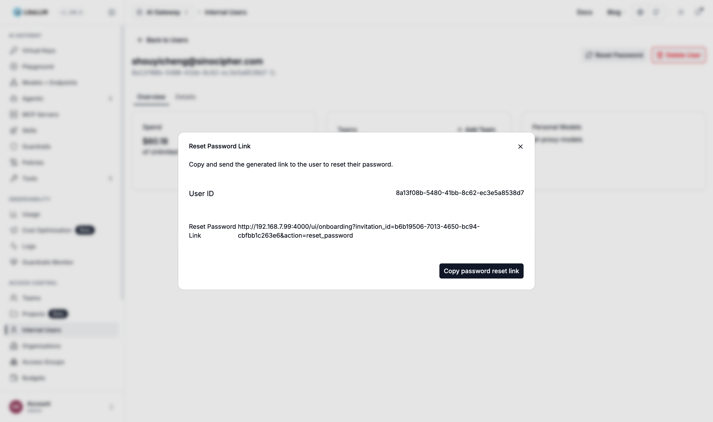

注意重置链接的地址在邀请链接基础上多了 `&action=reset_password`：

```
http://192.168.7.99:4000/ui/onboarding?invitation_id=xxxxxxxx-xxxx-xxxx-xxxx-xxxxxxxxxxxx&action=reset_password
```

用户打开后设置密码即可登录，效果与重新邀请一致。如果该用户从未注册成功、账号本身也需要重建，则先在 Actions 菜单里 `Delete user` 删除，再按 3.2 重新邀请

用户列表 Actions 菜单共四项：`Edit user`（编辑，含角色、预算等）、`Reset password`（生成重置链接）、`Copy user ID`（复制用户 ID）、`Delete user`（删除用户）

---

## 四、查看请求日志

### 4.1 进入日志页面

左侧菜单点击 **Logs**，进入请求日志页面。页面地址为 http://192.168.7.99:4000/ui/logs

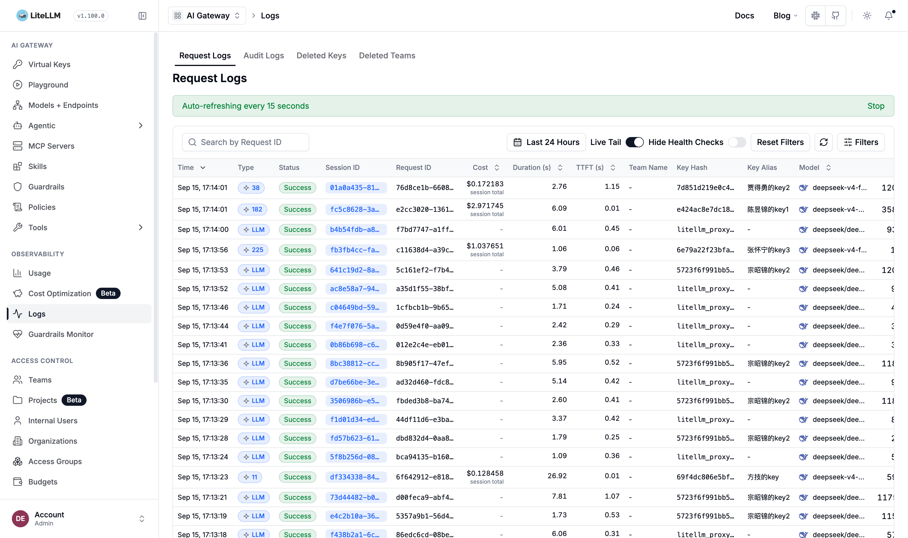

页面顶部有四个标签页：

| 标签页 | 内容 |
|---|---|
| Request Logs | 模型请求日志，日常最常用 |
| Audit Logs | 管理操作审计日志 |
| Deleted Keys | 已删除密钥的记录 |
| Deleted Teams | 已删除团队的记录 |

Request Logs 标签页的工具栏分两块：上方左侧是时间范围选择器（默认 `Last 24 Hours`），右侧是自动刷新状态提示（`Auto-refreshing every 15 seconds`，可用旁边的 `Stop` 暂停）；下方一排是 `Live Tail` 实时跟随、`Hide Health Checks` 隐藏健康检查请求、`Reset Filters` 重置筛选、`Filters` 打开筛选面板

列表上方还有按 Request ID 搜索的搜索框，以及每页行数选择器

### 4.2 筛选日志

点击 `Filters` 按钮，右侧滑出筛选面板，提供以下筛选条件：

| 筛选项 | 说明 |
|---|---|
| Team ID | 按团队筛选 |
| Key Alias | 按密钥别名筛选 |
| Model | 按模型名称筛选 |
| User ID | 按内部用户筛选 |
| End User | 按终端用户筛选 |
| Error Code | 按错误码筛选 |
| Status | 按状态筛选（All Statuses / Success / Failure） |
| Cache | 按缓存命中筛选（All Requests / Cache Hit / Cache Miss） |
| Error Message | 按错误信息文本筛选 |
| Key Hash | 按密钥哈希筛选 |
| Session ID | 按会话 ID 筛选 |
| Public model / search tool | 按公开模型名或搜索工具筛选 |

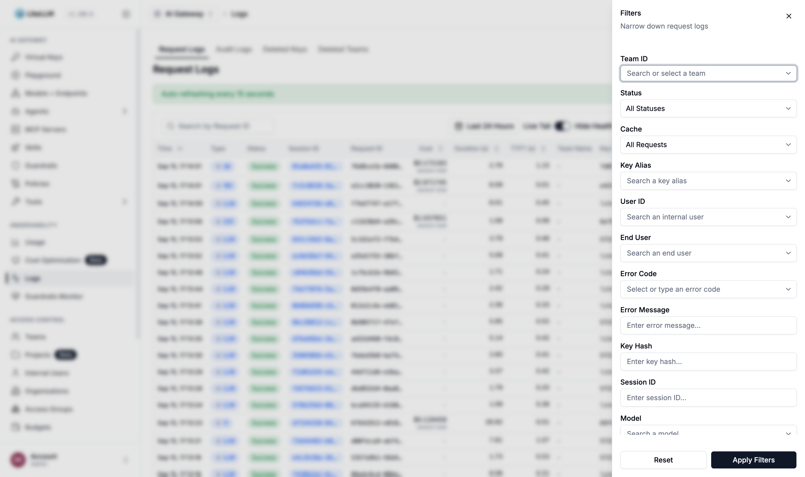

与 v1.0 相比，筛选条件从 6 项扩充到 12 项，且不再常驻页面顶部

### 4.3 日志列表字段说明

每条日志展示的关键字段：

| 字段 | 说明 |
|---|---|
| Time | 请求时间 |
| Type | 请求类型，如 LLM |
| Status | 请求状态（Success / Failure） |
| Session ID | 会话标识，同一会话的多次请求共享 |
| Request ID | 请求唯一标识 |
| Cost | 消费金额（美元） |
| Duration (s) | 请求耗时（秒） |
| TTFT (s) | 首 token 时间（秒），流式请求的关键指标 |
| Team Name | 所属团队 |
| Key Hash | 使用的密钥哈希 |
| Key Alias | 密钥别名 |
| Model | 调用的模型名称 |
| Tokens | 消耗的 Token 总量 |
| Internal User | 发起请求的内部用户 |
| End User | 终端用户标识 |
| Tags | 请求携带的标签 |

注意与 v1.0 的差异：v1.0 手册里的 `Spend` 现名为 `Cost`，`Total Tokens` / `Prompt Tokens` / `Completion Tokens` 三列合并为 `Tokens` 一列，详细的输入输出拆分在 4.4 的详情抽屉里查看。`TTFT (s)`、`Session ID`、`Team Name`、`Key Hash` 是新增列

### 4.4 查看请求详情

点击某条日志，从右侧滑出详情抽屉，可查看完整的请求与响应数据

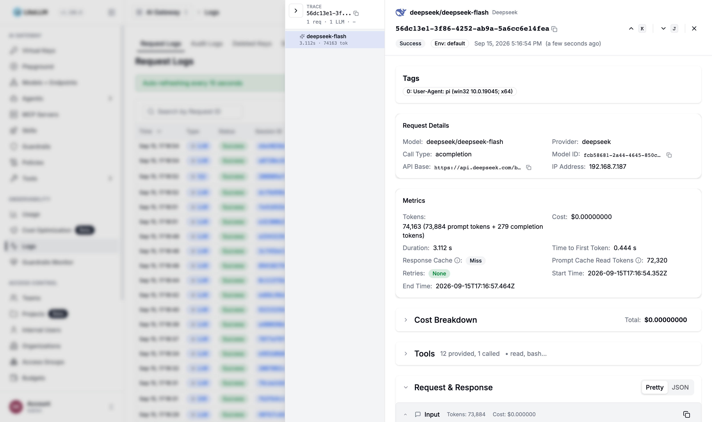

抽屉内容分四部分：

**顶部 TRACE 区**：展示本次请求的调用链，包括请求 ID、模型、耗时、Token 数、Provider、状态与时间，以及请求携带的 Tags（例如客户端的 User-Agent）

**Request Details**：Model、Provider、Call Type、Model ID、API Base、IP Address

**Metrics**：Tokens（拆分为 prompt tokens 与 completion tokens）、Cost、Duration、Time to First Token、Response Cache、Prompt Cache Read Tokens、Retries、Start Time、End Time

**Cost Breakdown**：列出本次调用的成本构成

**Tools**：本次请求提供了哪些工具、实际调用了哪些

**Request & Response**：在 `Pretty` 与 `JSON` 两种视图间切换，可查看完整的消息内容（system 提示、历史消息、工具调用）与模型响应原文

排查问题时，`Prompt Cache Read Tokens` 与 `Response Cache` 是判断计费是否合理的关键字段，缓存命中的输入按更低单价计费

### 4.5 数据导出

v1.0 手册里的「日志导出」在 v1.100.0 的内置管理后台中已不存在，Logs 页面不再提供导出按钮

需要导出数据时，改到 **Usage** 页面的 `Export Data` 按钮，点击后弹出导出配置窗口

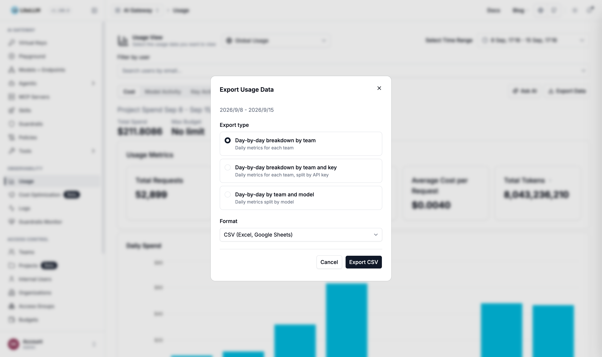

导出窗口提供：

- 顶部显示当前选定的日期范围
- **Export type**：三种粒度可选，分别按团队、按团队加密钥、按团队加模型做每日拆分
- **Format**：CSV (Excel, Google Sheets)
- 点击 `Export CSV` 下载文件

导出内容是每日聚合的用量与消费数据，适合对账与成本分析。如果需要逐条请求的原始日志，需要通过后端数据库或 `/metrics` 之外的接口另行获取

---

## 五、查看用量统计

### 5.1 进入用量页面

左侧菜单点击 **Usage**，进入用量统计页面。页面地址为 http://192.168.7.99:4000/ui/usage

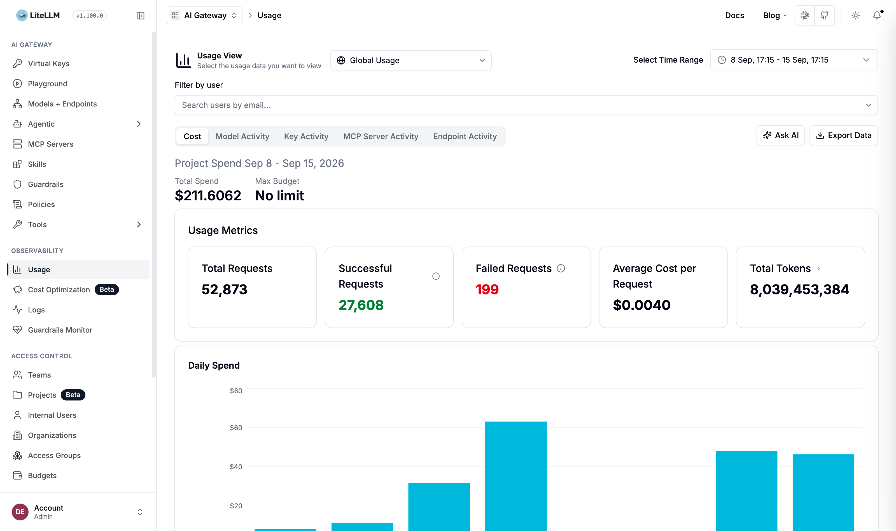

页面顶部是 `Usage View` 控制区：

- 左上角 `Global Usage` 下拉：在全局用量与个人用量之间切换
- 时间范围选择器：默认最近 7 天，可自行调整
- `Filter by user`：按用户筛选（仅管理员可见），输入邮箱即可筛选

控制区下方是五个标签页：`Cost`、`Model Activity`、`Key Activity`、`MCP Server Activity`、`Endpoint Activity`

标签页右侧是 `Ask AI`（用自然语言提问用量）与 `Export Data` 两个按钮

### 5.2 统计维度

Cost 标签页给出总体指标卡片：Total Requests（总请求数）、Total Successful Requests（成功请求数）、Total Tokens（总 Token 数）、Total Spend（总消费金额），下方是 Total Tokens Over Time 与 Total Requests Over Time 两条趋势曲线

页面继续往下是分布图表：Top Virtual Keys（按密钥的消费排名）、Top Public Model Names（按模型的消费排名）、Spend by Provider（按供应商的消费汇总，含成功数、失败数与 Token 数）

切换到 `Model Activity` 标签页，可以按模型维度查看用量，表头可在 `Public Model Name` 与 `Litellm Model Name` 之间切换

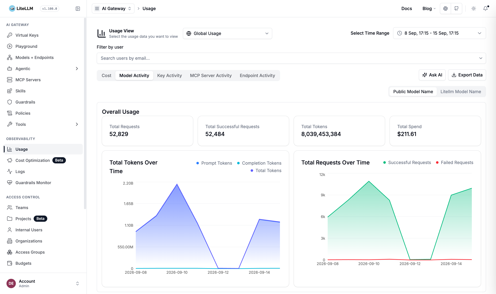

各标签页对应的统计维度：

| 标签页 | 统计维度 |
|---|---|
| Cost | 总消费、请求数、Token 数趋势，以及密钥、模型、供应商分布 |
| Model Activity | 各模型的调用次数、消费金额、Token 用量排名 |
| Key Activity | 各 API Key 的消费排名与占比 |
| MCP Server Activity | 各 MCP Server 的调用统计 |
| Endpoint Activity | 各网关端点（`/chat/completions`、`/responses`、`/v1/messages` 等）的请求分布 |

图表支持 `Table View` 与 `Chart View` 两种呈现方式

### 5.3 查看用户个人用量

用户个人用量不再从用户详情页查看。v1.100.0 中，点击 Internal Users 列表里的用户进入的详情页只展示账号信息，包括 Spend 总额、所属 Teams、Personal Models、Reset Password 与 Delete User 操作，页面地址形如 http://192.168.7.99:4000/ui/users?user=xxxxxxxx

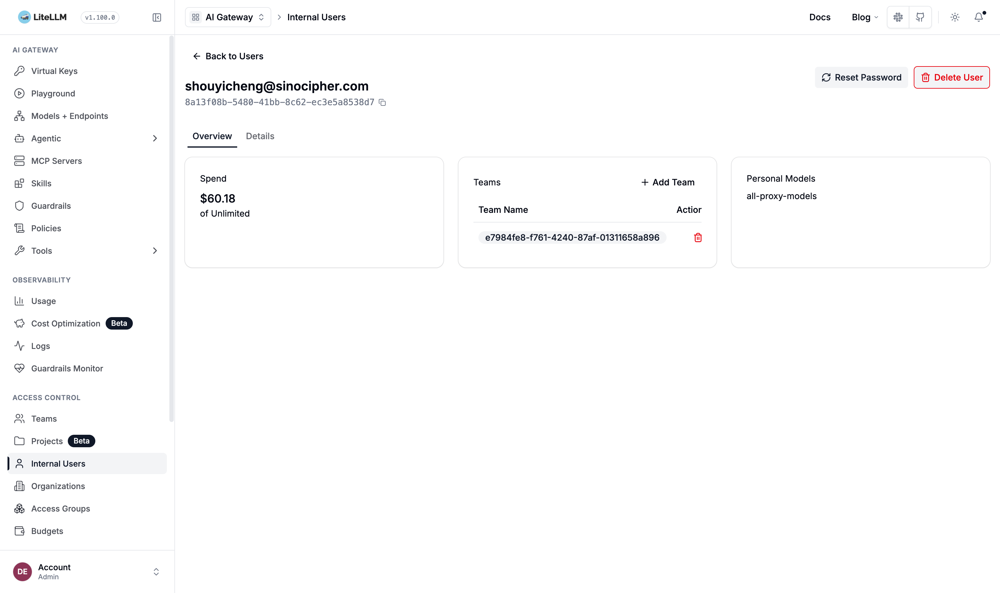

要查看某个用户的消费趋势与每日用量明细，在 **Usage** 页面顶部的 `Filter by user` 输入框里输入用户邮箱并选中该用户，页面会切换为该用户的专属视图，展示：

- Project Spend：所选时间范围内的个人消费总额
- Max Budget：预算上限
- Usage Metrics：Total Requests、Successful Requests、Failed Requests、Average Cost per Request、Total Tokens
- Daily Spend：每日消费柱状图
- Gateway Requests by Endpoint：按端点的请求分布
- Top Virtual Keys：该用户名下各密钥的消费排名

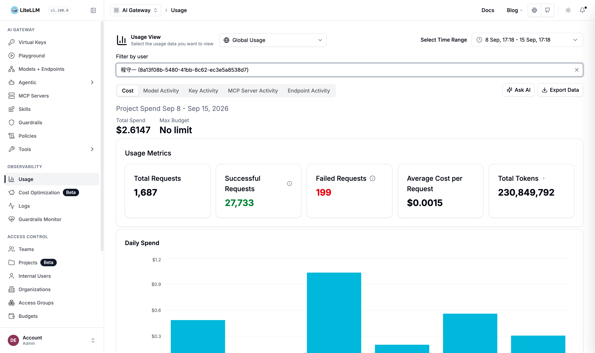

---

## 附录一：创建 API Key（给用户参考）

管理员创建用户并发送邀请链接后，用户注册登录即可自行创建 API Key。前提是创建用户时 `Personal Key Creation` 已开启，且用户角色不是 `View Only`

1. 用户在左侧菜单进入 **Virtual Keys**，点击 `+ Create New Key`

   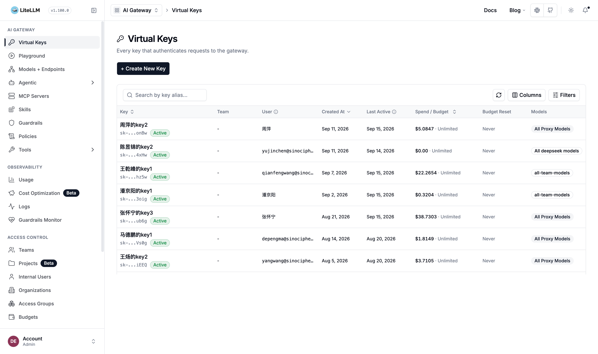

2. 在弹出的表单里填写密钥信息

   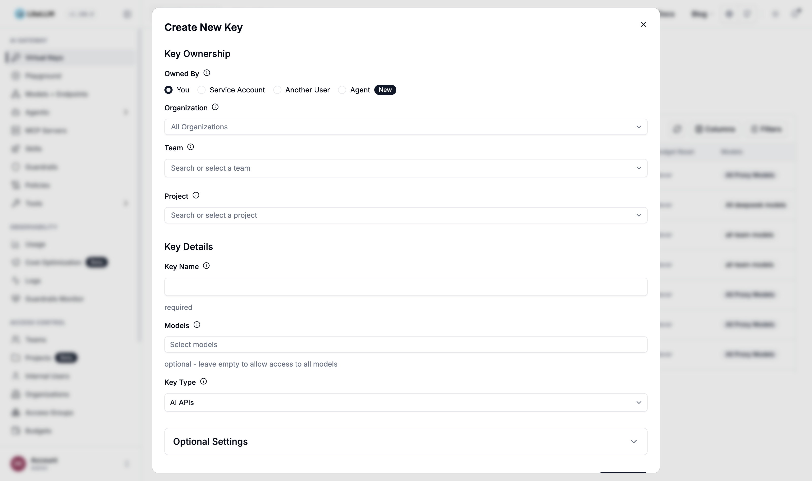

   | 字段 | 说明 |
   |---|---|
   | Key Ownership - Owned By | 密钥归属，可选 You、Service Account、Another User、Agent |
   | Key Ownership - Organization / Team / Project | 密钥归属的组织、团队或项目 |
   | Key Name | 密钥名称，必填，同一团队下不可重名 |
   | Models | 允许访问的模型，留空表示可访问全部模型 |
   | Key Type | 密钥类型，默认 `AI APIs` |
   | Optional Settings | 预算、限流、过期时间等可选配置 |

   填完点击 `Create Key`

3. 创建成功后，弹出 `Save your Key` 窗口，立即复制保存密钥

   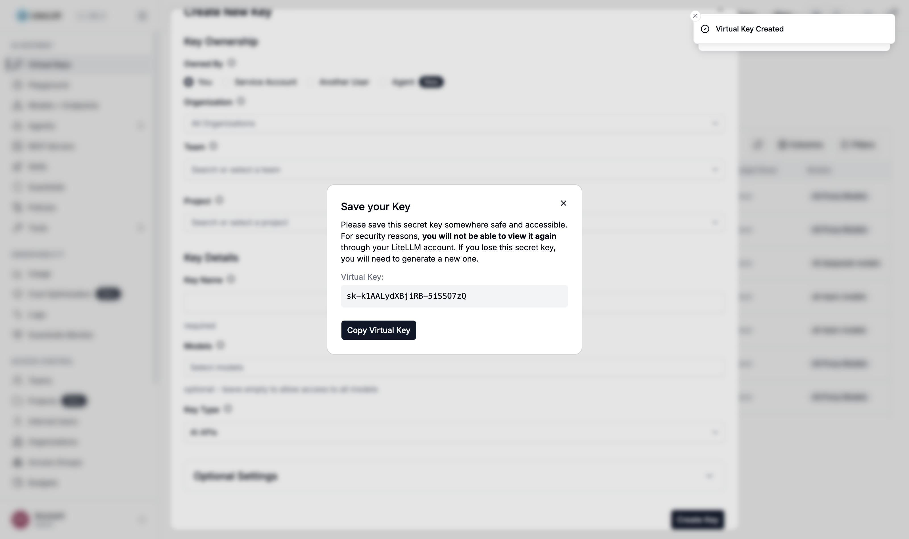

   密钥仅展示一次，关闭弹窗后无法再次查看。遗失需重新创建

   点击 `Copy Virtual Key` 复制密钥，然后妥善保存

---

## 附录二：API 调用验证

密钥创建后，可用 curl 验证是否正常工作：

```bash
curl -sS "http://192.168.7.99:4000/v1/chat/completions" \
  -H "Content-Type: application/json" \
  -H "Authorization: Bearer <你的Key>" \
  -d '{
    "model": "deepseek-v4-flash",
    "messages": [
      {"role": "user", "content": "你好"}
    ]
  }'
```

返回 JSON 包含 `choices` 与 `usage` 即表示配置正确。实测返回示例（已截断）：

```json
{
  "model": "deepseek-v4-flash",
  "object": "chat.completion",
  "choices": [
    {
      "finish_reason": "stop",
      "index": 0,
      "message": {
        "content": "你好！很高兴见到你，有什么我可以帮忙的吗？",
        "role": "assistant"
      }
    }
  ],
  "usage": {
    "completion_tokens": 55,
    "prompt_tokens": 31,
    "total_tokens": 86,
    "prompt_cache_hit_tokens": 0,
    "prompt_cache_miss_tokens": 31
  }
}
```

调用失败时的常见返回（下面两条为在 192.168.7.99 上实测）：

| 返回 | 实测错误信息 |
|---|---|
| 401 Unauthorized | `Authentication Error, Invalid proxy server token passed`，密钥错误、已删除或已过期；请求未带密钥时返回 `Authentication Error, No api key passed in` |
| 400 Bad Request | `There are no healthy deployments for this model. Received Model Group=xxx`，`model` 名称不在网关已配置的模型列表里，用 `GET /v1/models` 查可用列表 |
| 429 Too Many Requests | 触发了密钥或用户的 tpm/rpm 限流，稍后重试或联系管理员调整限额 |

`.env` 中的 `LITELLM_MASTER_KEY` 拥有全部权限，不要下发给普通用户
