# AI Token 网关管理员操作手册

本文档面向网关管理员，说明如何通过 LiteLLM 管理后台创建新用户、生成邀请链接、以及查看请求日志与用量统计

本文档基于 v1.1 重写，界面截图全部取自当前生产环境 `192.168.7.99` 上运行的中文版管理后台（镜像 `litellm-zhcn:v1.100.0-zh.4`）

管理后台：http://192.168.7.99:4000/ui/

网关地址：http://192.168.7.99:4000

---

## 一、变更记录

| 版本 | 日期 | 变更摘要 | 修改人 |
|---|---|---|---|
| v1.2 | 2026-09-20 | 网关升级为中文版镜像 `litellm-zhcn:v1.100.0-zh.4`，按中文界面重做全部截图与字段名；新增中文化覆盖范围说明 | 张忠源 |
| v1.1 | 2026-09-15 | 按 v1.100.0 内置管理后台重做全部截图，修正邀请链接地址、用户列表字段、日志字段、日志导出、个人用量入口等过时描述 | 张忠源 |
| v1.0 | 2026-08-11 | 初始版本 | 张忠源 |

### 中文化覆盖范围（重要）

当前网关用的是自研中文镜像，界面翻译并不完整。下面按实测结果列出，写文档或培训同事时请以实际界面为准：

| 区域 | 状态 |
|---|---|
| 登录页 | 已中文化 |
| 左侧导航菜单 | 已中文化 |
| 内部用户列表、虚拟密钥列表 | 已中文化（含表头、行操作菜单、分页、搜索框） |
| 日志页面与筛选面板 | 已中文化（筛选项的取值仍为英文，如 `All Statuses`、`All Requests`） |
| 用量页面 | 已中文化（`Table View` / `Chart View` 两个按钮仍为英文） |
| 模型与端点页面 | 已中文化 |
| 创建密钥弹窗 | 已中文化 |
| 日志详情抽屉 | 大部分中文化（标题 `Request xxx details`、状态 `Success`、相对时间仍为英文） |
| 导出用量数据弹窗 | 仅标题中文化，弹窗内容仍为英文 |
| **邀请用户弹窗** | **基本未中文化**，字段名全为英文 |
| 用户角色名称 | 未中文化，仍为 `Internal User (Create/Delete/View)` 等英文 |
| 注册（Sign Up）页面 | 未中文化 |
| 重置密码链接弹窗 | 未中文化（仅关闭按钮） |
| 右上角账号区 | 未中文化，仍显示 `DE` / `Account` / `Admin` |

界面上出现英文时不是故障，直接照常操作即可

---

## 二、登录管理后台

在浏览器中打开 http://192.168.7.99:4000/ui/ ，进入 LiteLLM 管理后台登录页面


输入管理员用户名和密码，点击 `登录`

管理员账号由网关部署时配置，通过服务器 `/opt/litellm/.env` 里的 `UI_USERNAME` / `UI_PASSWORD` 环境变量设定。页面上的提示文字说明，如果不单独设置这两个变量，默认用户名是 `admin`，密码是 `LITELLM_MASTER_KEY` 的值。生产环境已单独设置用户名和密码，请使用分配到的账号登录

登录后默认落在 **虚拟密钥** 页面（地址仍是 http://192.168.7.99:4000/ui/ ），左下角显示当前版本号 `v1.100.0`

左侧菜单按中文分组，管理员日常最常用的三个入口是：

- 可观测性分组下的 **用量**：用量统计
- 可观测性分组下的 **日志**：请求日志
- 访问控制分组下的 **内部用户**：用户管理

---

## 三、创建新用户并发送邀请

### 3.1 进入内部用户页面

左侧菜单点击 **内部用户**，进入用户管理列表页面。页面地址为 http://192.168.7.99:4000/ui/users

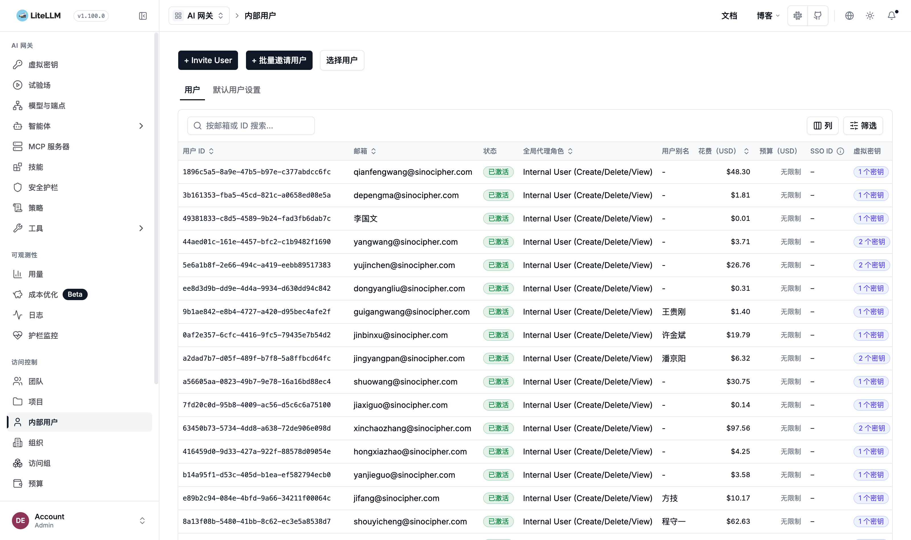

用户列表展示已注册用户的用户 ID、邮箱、状态、全局代理角色、用户别名、花费（USD）、预算（USD）、SSO ID、虚拟密钥、创建时间、更新时间、操作

页面顶部有三个操作入口：列表左上方是按邮箱或 ID 搜索的搜索框，`列` 按钮控制显示哪些列，`筛选` 按钮打开筛选面板

右上角有两个创建入口，单个创建用 `+ Invite User`，批量创建用 `+ 批量邀请用户`。注意单个创建的按钮文案仍是英文，这是中文化的遗漏，不影响功能

### 3.2 点击「+ Invite User」创建新用户

点击页面右上角的 `+ Invite User` 按钮，弹出创建用户表单


该弹窗目前基本未中文化，字段说明如下：

| 字段 | 说明 | 是否必填 |
|---|---|---|
| User Email | 用户的邮箱地址 | 是 |
| Global Proxy Role | 用户全局角色，默认 `Internal User (View Only)` | 否 |
| Team | 用户所属团队，选中后该用户会以 `user` 角色加入团队 | 否 |
| Organization | 用户所属组织，可多选 | 否 |
| Metadata | 附加元数据，JSON 格式 | 否 |
| Send invitation email | 是否发送邮件通知，需要先配置邮件服务 | 否 |
| Personal Key Creation | 折叠区，展开后可指定该用户可访问的模型范围 | 否 |

表单顶部有一段提示：只有在配置了邮件集成（SMTP、Resend 或 SendGrid）后，新用户才会收到邮件邀请。当前生产环境未配置邮件服务，因此不要依赖 `Send invitation email`，请按 3.4 手动复制邀请链接发给用户

**Personal Key Creation 折叠区容易漏填。** 展开后的 `Models` 字段决定该用户能调用哪些模型。实测如果这里留空且用户又不属于任何团队，用户创建密钥后调用会返回 403 `User not allowed to access model. No default model access, only team models allowed`，需要管理员回头补配。建议邀请时直接选 `All Proxy Models`

### 3.3 填写用户信息

填写 `User Email`，把 `Global Proxy Role` 设为 `Internal User (Create/Delete/View)`，然后点击 `Invite User` 按钮完成创建

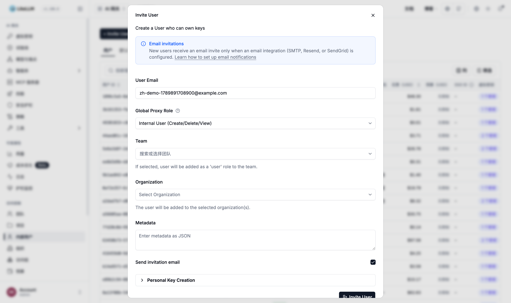

角色说明（下拉选项仍为英文）：

| 角色 | 权限 |
|---|---|
| `Admin (All Permissions)` | 管理员，拥有全部权限 |
| `Admin (View Only)` | 只读管理员，可查看全部密钥与花费 |
| `Internal User (Create/Delete/View)` | 普通用户，可查看、创建、删除自己的密钥，查看自己的花费 |
| `Internal User (View Only)` | 只读用户，只能查看自己的密钥与花费，不能创建密钥 |

需要用户能自己创建 API Key，必须选 `Internal User (Create/Delete/View)`。选 `View Only` 时用户看不到 `+ 新建密钥` 按钮

### 3.4 复制邀请链接

用户创建成功后，系统弹出 `Invitation Link` 弹窗，显示：

- **User ID**：用户的唯一标识
- **Invitation Link**：邀请链接

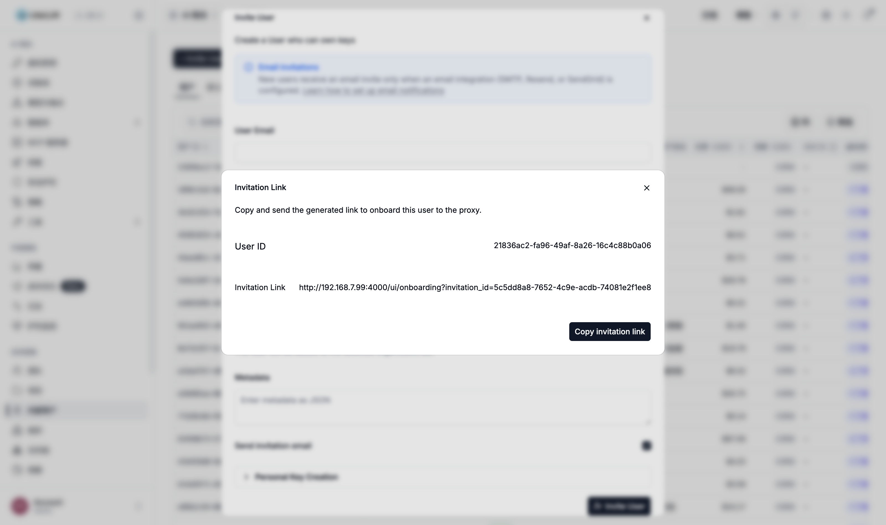

点击 `Copy invitation link` 按钮，将链接发送给用户

链接格式：

```
http://192.168.7.99:4000/ui/onboarding?invitation_id=xxxxxxxx-xxxx-xxxx-xxxx-xxxxxxxxxxxx
```

注意路径是 `/ui/onboarding`，不是 `/ui`

### 3.5 用户注册流程

用户点击邀请链接后，将打开注册页面。该页面目前仍是英文：

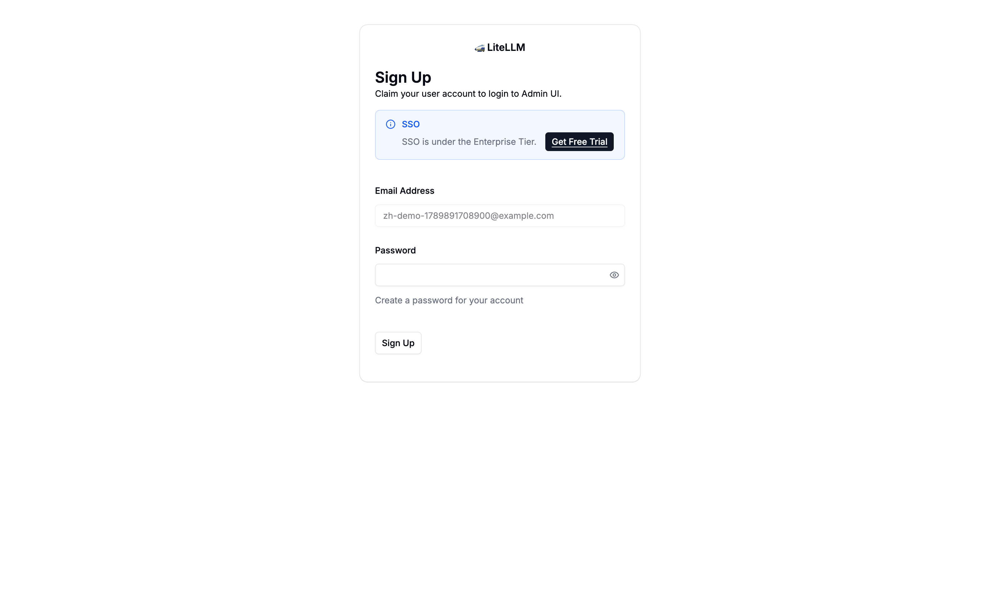

页面上：

- **Email Address**（邮箱）：已预填，不可修改
- **Password**（密码）：用户自行设置登录密码
- 点击 `Sign Up` 完成注册

页面上的 SSO 入口属于企业版功能，当前部署未启用，忽略即可

注册完成后，浏览器跳转到 `http://192.168.7.99:4000/ui/?login=success`，用户已处于登录状态

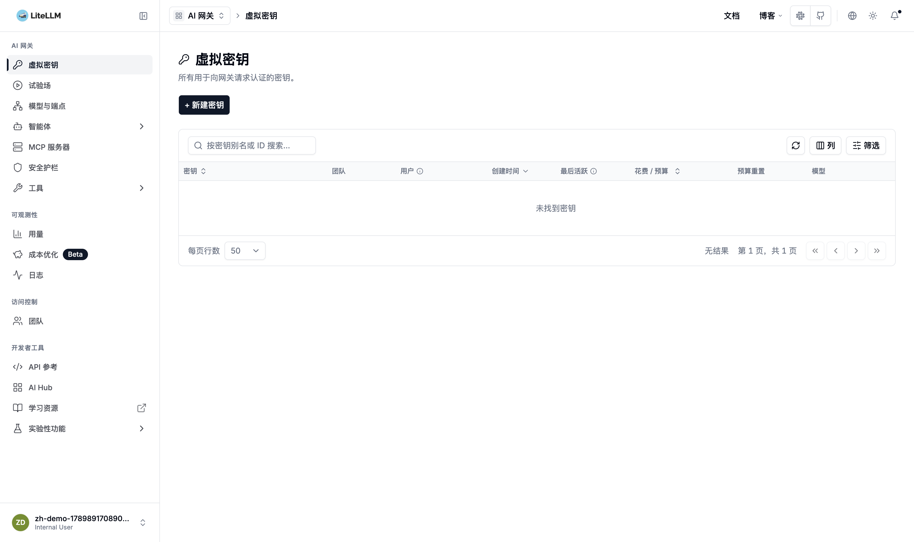

此后用户可随时使用邮箱加密码登录 http://192.168.7.99:4000/ui/

邀请链接有效期 7 天（数据库里 `expires_at` 减去 `created_at` 正好是 7 天）

如用户未及时注册、链接已失效，界面里没有「重新生成邀请链接」的按钮，可改用重置密码链接：在用户列表对应行的 `操作` 菜单里选 `重置密码`，或进入用户详情页点击 `重置密码`，系统会生成一个重置链接

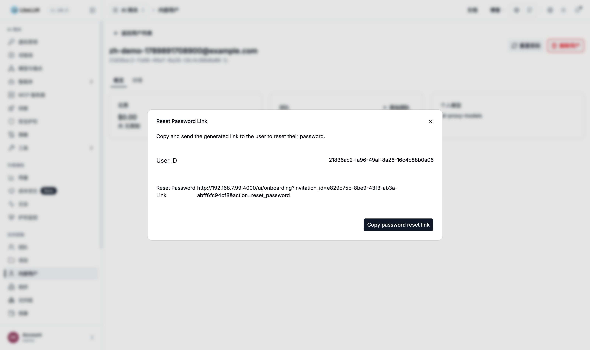

注意重置链接的地址在邀请链接基础上多了 `&action=reset_password`：

```
http://192.168.7.99:4000/ui/onboarding?invitation_id=xxxxxxxx-xxxx-xxxx-xxxx-xxxxxxxxxxxx&action=reset_password
```

用户打开后设置密码即可登录，效果与重新邀请一致。如果该用户从未注册成功、账号本身也需要重建，则先在 `操作` 菜单里 `删除用户` 删除，再按 3.2 重新邀请

用户列表 `操作` 菜单共四项，均为中文：`编辑用户`（编辑角色、预算等）、`重置密码`（生成重置链接）、`复制用户 ID`、`删除用户`

用户列表的 `筛选` 面板提供用户 ID、SSO ID、角色、团队四个条件，填好后点 `应用筛选` 生效

---

## 四、查看请求日志

### 4.1 进入日志页面

左侧菜单点击 **日志**，进入请求日志页面。页面地址为 http://192.168.7.99:4000/ui/logs

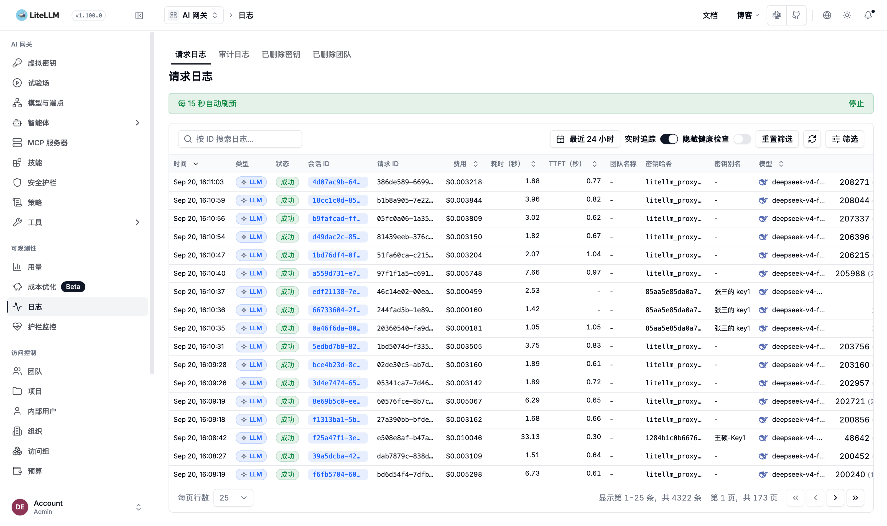

页面顶部有四个标签页：

| 标签页 | 内容 |
|---|---|
| 请求日志 | 模型请求日志，日常最常用 |
| 审计日志 | 管理操作审计日志 |
| 已删除密钥 | 已删除密钥的记录 |
| 已删除团队 | 已删除团队的记录 |

请求日志标签页的工具栏分两块：上方左侧是时间范围选择器（默认 `最近 24 小时`），右侧是自动刷新状态提示，可用旁边的 `停止` 暂停；下方一排是实时跟随、隐藏健康检查请求、`重置筛选`、`筛选`

列表上方还有按 ID 搜索日志的搜索框，以及每页行数选择器

### 4.2 筛选日志

点击 `筛选` 按钮，右侧滑出筛选面板，提供以下筛选条件：

| 筛选项 | 说明 |
|---|---|
| 团队 ID | 按团队筛选 |
| 状态 | 按状态筛选（取值为英文 `All Statuses` / `Success` / `Failure`） |
| 缓存 | 按缓存命中筛选（取值为英文 `All Requests` / `Cache Hit` / `Cache Miss`） |
| 密钥别名 | 按密钥别名筛选 |
| 用户 ID | 按内部用户筛选 |
| 终端用户 | 按终端用户筛选 |
| 错误码 | 按错误码筛选 |
| 错误消息 | 按错误信息文本筛选 |
| 密钥哈希 | 按密钥哈希筛选 |
| 会话 ID | 按会话 ID 筛选 |
| 模型 | 按模型名称筛选 |
| 公共模型 / 搜索工具 | 按公开模型名或搜索工具筛选 |

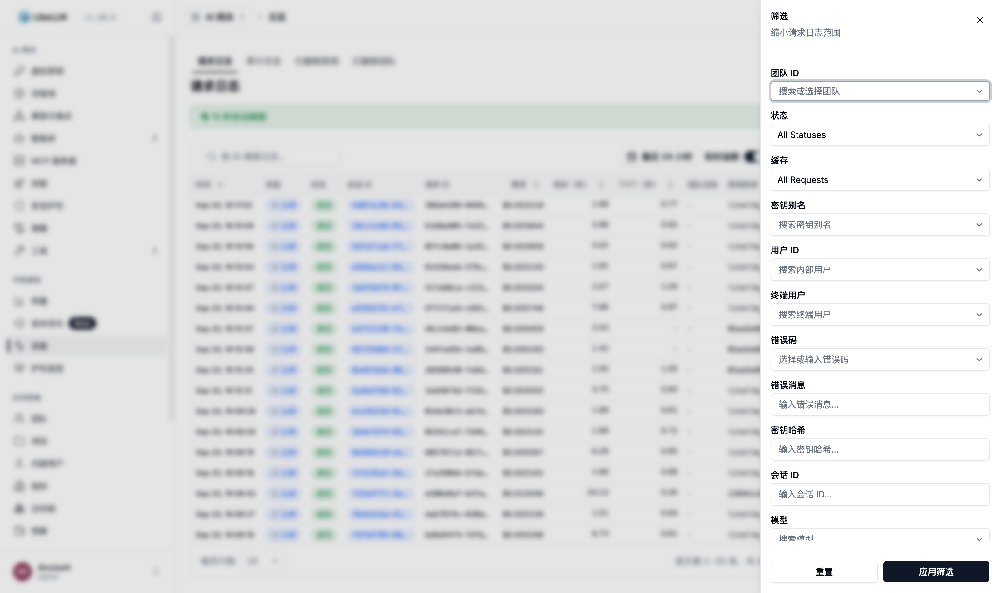

填好后点 `应用筛选` 生效，`重置` 清空条件

注意 `状态` 与 `缓存` 两项的标签已中文化，但下拉取值仍是英文，不要以为是没生效

### 4.3 日志列表字段说明

每条日志展示的关键字段：

| 字段 | 说明 |
|---|---|
| 时间 | 请求时间 |
| 类型 | 请求类型，如 LLM |
| 状态 | 请求状态（Success / Failure） |
| 会话 ID | 会话标识，同一会话的多次请求共享 |
| 请求 ID | 请求唯一标识 |
| 费用 | 消费金额（美元） |
| 耗时（秒） | 请求耗时 |
| TTFT（秒） | 首 token 时间，流式请求的关键指标 |
| 团队名称 | 所属团队 |
| 密钥哈希 | 使用的密钥哈希 |
| 密钥别名 | 密钥别名 |
| 模型 | 调用的模型名称 |
| Token | 消耗的 Token 总量 |
| 内部用户 | 发起请求的内部用户 |
| 终端用户 | 终端用户标识 |
| 标签 | 请求携带的标签 |

### 4.4 查看请求详情

点击某条日志，从右侧滑出详情抽屉，可查看完整的请求与响应数据

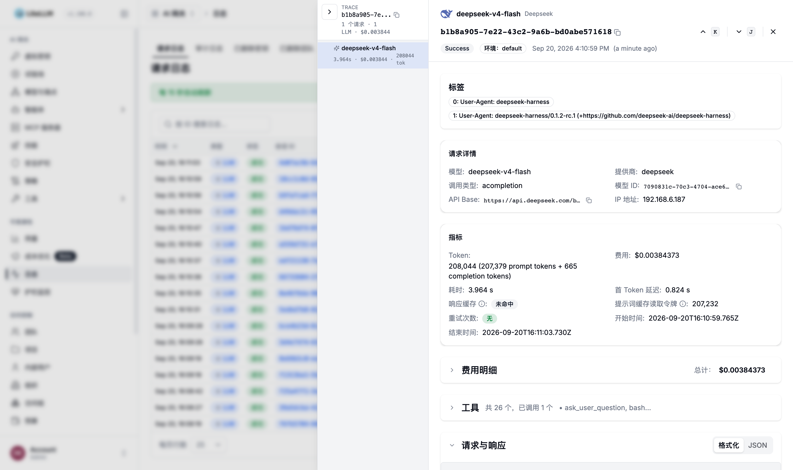

抽屉内容分四部分：

**顶部 TRACE 区**：展示本次请求的调用链，包括请求 ID、模型、耗时、费用、Token 数、Provider 与时间，以及请求携带的标签（例如客户端的 User-Agent）。这一块的标题、状态徽标与相对时间仍是英文

**请求详情**：模型、提供商、调用类型、模型 ID、API Base、IP 地址

**指标**：Token（拆分为 prompt tokens 与 completion tokens）、费用、耗时、首 Token 延迟、响应缓存、提示词缓存读取令牌、重试次数、开始时间、结束时间

**费用明细**：列出本次调用的成本构成

**工具**：本次请求提供了哪些工具、实际调用了哪些

**请求与响应**：在 Pretty 与 JSON 两种视图间切换，可查看完整的消息内容与模型响应原文

排查问题时，`提示词缓存读取令牌` 与 `响应缓存` 是判断计费是否合理的关键字段，缓存命中的输入按更低单价计费

### 4.5 数据导出

日志页面不提供导出功能。需要导出数据时，改到 **用量** 页面的 `导出数据` 按钮，点击后弹出导出配置窗口

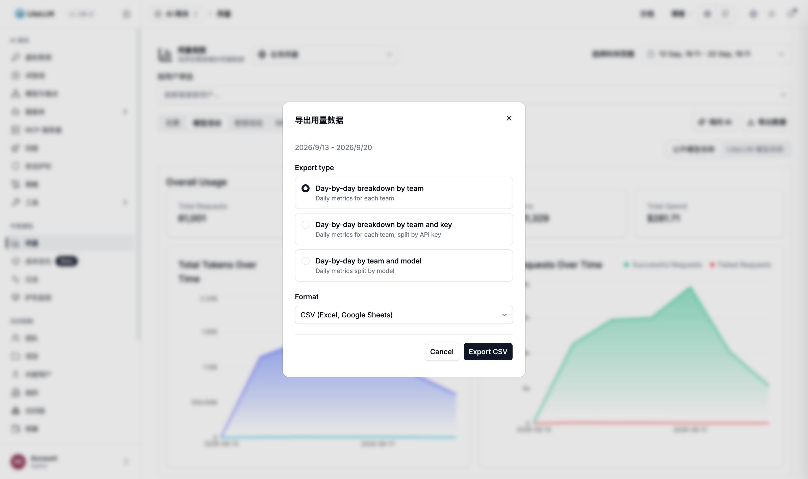

导出窗口目前只有标题 `导出用量数据` 和关闭按钮中文化，内容仍为英文：

- 顶部显示当前选定的日期范围
- **Export type**：三种粒度可选，分别按团队、按团队加密钥、按团队加模型做每日拆分
- **Format**：CSV (Excel, Google Sheets)
- 点击 `Export CSV` 下载文件

导出内容是每日聚合的用量与消费数据，适合对账与成本分析。如果需要逐条请求的原始日志，需要通过后端数据库另行获取

---

## 五、查看用量统计

### 5.1 进入用量页面

左侧菜单点击 **用量**，进入用量统计页面。页面地址为 http://192.168.7.99:4000/ui/usage

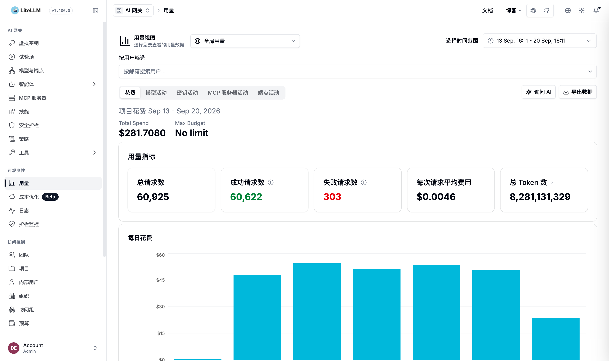

页面顶部是用量视图控制区：

- 左上角 `全局用量` 下拉：在全局用量与个人用量之间切换
- 时间范围选择器：默认最近 7 天，可自行调整
- `按用户筛选`：输入邮箱即可筛选指定用户（仅管理员可见）

控制区下方是五个标签页：`花费`、`模型活动`、`密钥活动`、`MCP 服务器活动`、`端点活动`

标签页右侧是 `询问 AI`（用自然语言提问用量）与 `导出数据` 两个按钮

### 5.2 统计维度

花费标签页给出总体指标卡片：总请求数、成功请求数、总 Token 数、总花费（Total Spend），下方是 Token 与请求数的趋势曲线

页面继续往下是分布图表：虚拟密钥排行（按密钥的消费排名）、公开模型名称排行（按模型的消费排名）、按提供商的消费汇总（含成功数、失败数与 Token 数）

切换到 `模型活动` 标签页，可以按模型维度查看用量，表头可在公开模型名称与 LiteLLM 模型名称之间切换

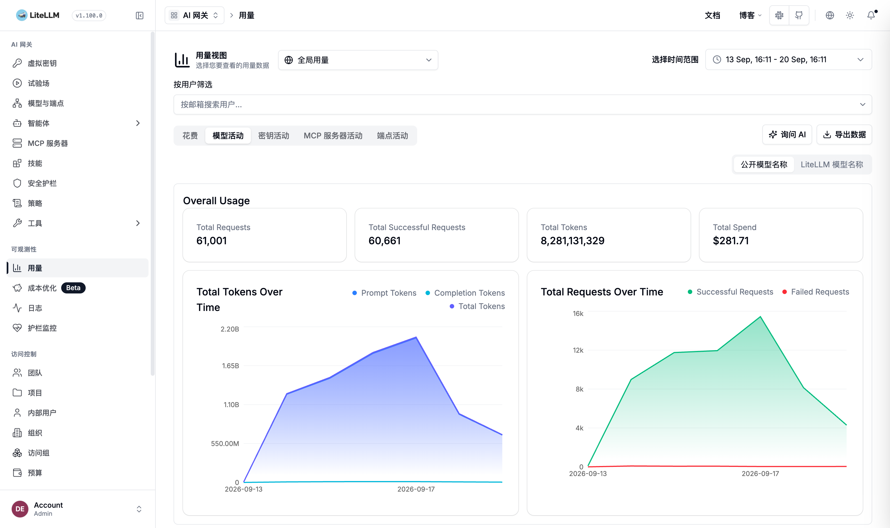

各标签页对应的统计维度：

| 标签页 | 统计维度 |
|---|---|
| 花费 | 总消费、请求数、Token 数趋势，以及密钥、模型、供应商分布 |
| 模型活动 | 各模型的调用次数、消费金额、Token 用量排名 |
| 密钥活动 | 各 API Key 的消费排名与占比 |
| MCP 服务器活动 | 各 MCP Server 的调用统计 |
| 端点活动 | 各网关端点（`/chat/completions`、`/responses`、`/v1/messages` 等）的请求分布 |

图表支持表格与图表两种呈现方式，对应按钮为 `Table View` 与 `Chart View`（未中文化）

### 5.3 查看用户个人用量

用户个人用量不在用户详情页。点击内部用户列表里的用户进入的详情页只展示账号信息，包括花费总额、所属团队、个人模型，以及 `重置密码` 与 `删除用户` 操作，页面地址形如 http://192.168.7.99:4000/ui/users?user=xxxxxxxx

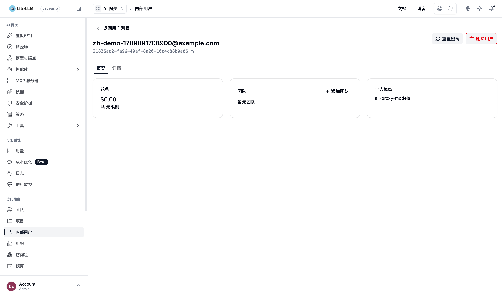

要查看某个用户的消费趋势与每日用量明细，在 **用量** 页面顶部的 `按用户筛选` 输入框里输入用户邮箱并选中该用户，页面会切换为该用户的专属视图，展示：

- 项目花费（Project Spend）：所选时间范围内的个人消费总额
- Max Budget：预算上限
- 用量指标：总请求数、成功请求数、失败请求数、每次请求平均费用、总 Token 数
- 每日花费柱状图
- 虚拟密钥排行

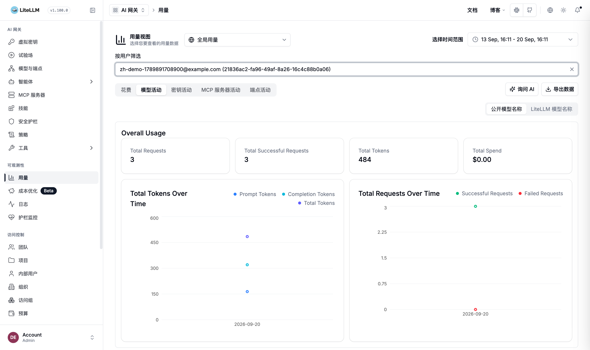

---

## 附录一：创建 API Key（给用户参考）

管理员创建用户并发送邀请链接后，用户注册登录即可自行创建 API Key。前提是创建用户时角色为 `Internal User (Create/Delete/View)`，且 `Personal Key Creation` 里配置了模型范围

1. 用户在左侧菜单进入 **虚拟密钥**，点击 `+ 新建密钥`

   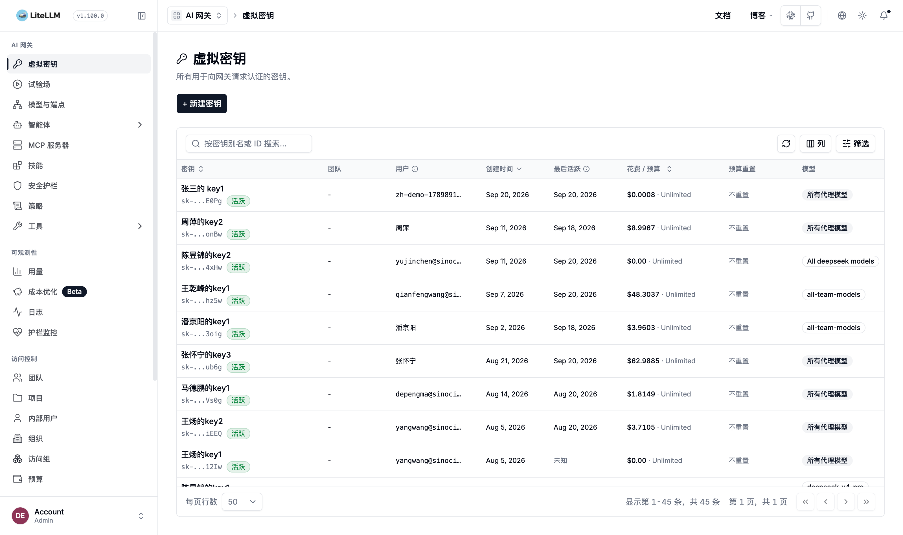

2. 在弹出的表单里填写密钥信息

   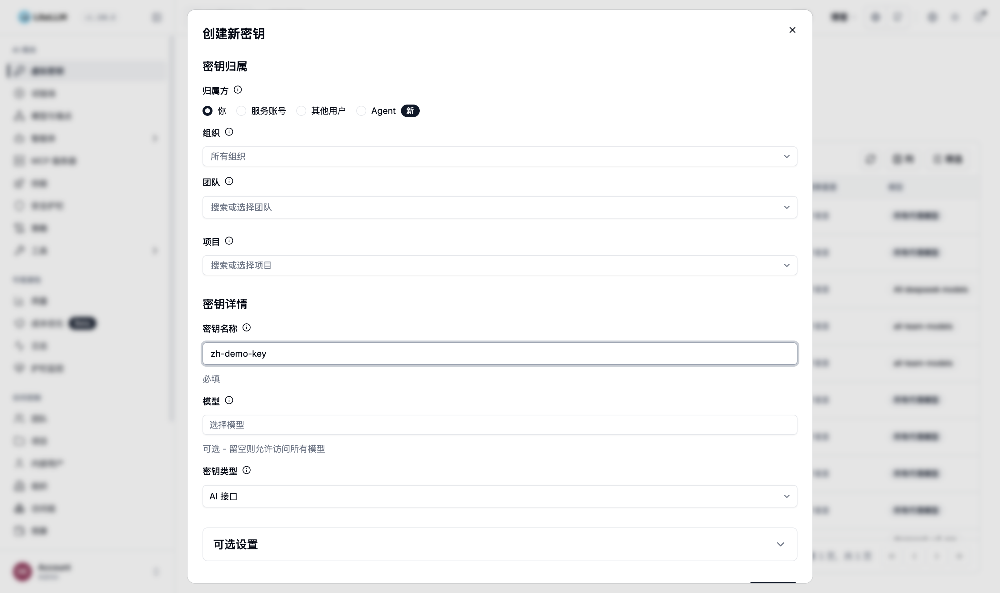

   | 字段 | 说明 |
   |---|---|
   | 密钥归属 - 归属方 | 密钥归属，可选 你、服务账号、其他用户、Agent |
   | 密钥归属 - 组织 / 团队 / 项目 | 密钥归属的组织、团队或项目 |
   | 密钥名称 | 密钥名称，必填，同一团队下不可重名 |
   | 模型 | 允许访问的模型，留空表示可访问全部模型 |
   | 密钥类型 | 密钥类型，默认 `AI 接口` |
   | 可选设置 | 预算、限流、过期时间等可选配置 |

   填完点击 `创建密钥`

3. 创建成功后，弹出保存密钥窗口，立即复制保存

   

   窗口标题 `保存你的密钥` 已中文化，正文与 `Copy Virtual Key` 按钮仍为英文

   密钥仅展示一次，关闭弹窗后无法再次查看。遗失需重新创建

   点击 `Copy Virtual Key` 复制密钥，然后妥善保存

---

## 附录二：API 调用验证

密钥创建后，可用 curl 验证是否正常工作：

```bash
curl -sS "http://192.168.7.99:4000/v1/chat/completions" \
  -H "Content-Type: application/json" \
  -H "Authorization: Bearer <你的Key>" \
  -d '{
    "model": "deepseek-v4-flash",
    "messages": [
      {"role": "user", "content": "你好"}
    ]
  }'
```

返回 JSON 包含 `choices` 与 `usage` 即表示配置正确。实测返回示例（已截断）：

```json
{
  "model": "deepseek-v4-flash",
  "object": "chat.completion",
  "choices": [
    {
      "finish_reason": "stop",
      "index": 0,
      "message": {
        "role": "assistant",
        "content": "你好！我是由深度求索公司开发的AI助手DeepSeek，可以帮你解答问题、处理信息并提供创意支持。"
      }
    }
  ],
  "usage": {
    "prompt_tokens": 31,
    "completion_tokens": 20,
    "total_tokens": 51,
    "prompt_cache_hit_tokens": 0,
    "prompt_cache_miss_tokens": 31
  }
}
```

调用失败时的常见返回（下面几条为在 192.168.7.99 上实测）：

| 返回 | 实测错误信息 |
|---|---|
| 401 Unauthorized | `Authentication Error, Invalid proxy server token passed`，密钥错误、已删除或已过期；请求未带密钥时返回 `Authentication Error, No api key passed in` |
| 403 Forbidden | `User not allowed to access model. No default model access, only team models allowed`，该用户没有配置模型访问范围，需在用户编辑页或 `Personal Key Creation` 里补配 |
| 400 Bad Request | `There are no healthy deployments for this model. Received Model Group=xxx`，`model` 名称不在网关已配置的模型列表里 |
| 429 Too Many Requests | 触发了密钥或用户的 tpm/rpm 限流，稍后重试或联系管理员调整限额 |

当前网关实际可用的模型名：`deepseek-v4-flash`、`deepseek-v4-pro`、`deepseek-v4-flash-vision-exp`、`deepseek/deepseek-chat`

`.env` 中的 `LITELLM_MASTER_KEY` 拥有全部权限，不要下发给普通用户
